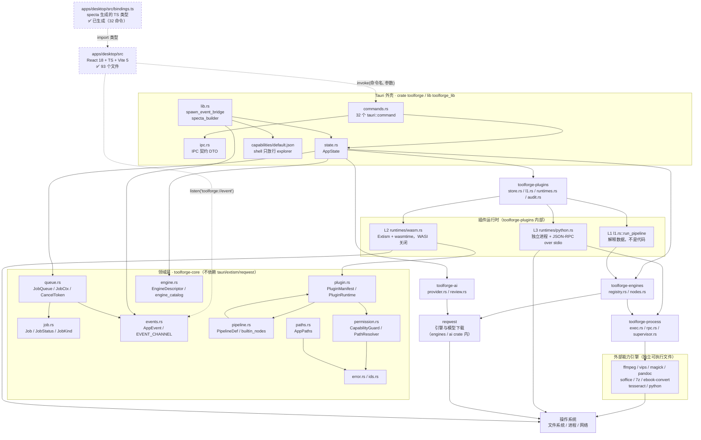
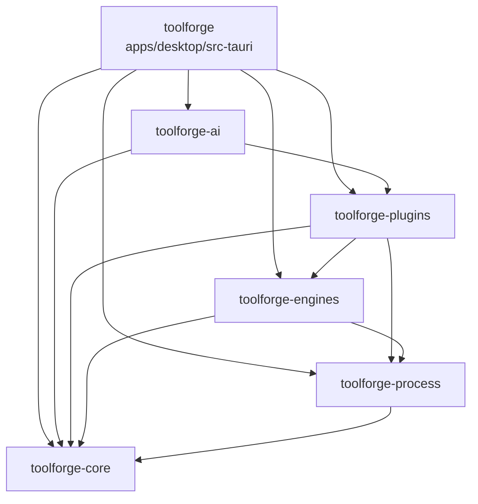

# ToolForge 架构设计

> 本文档描述 ToolForge 的**分层结构、依赖方向、一次完整数据流、以及关键设计决策的理由**。
> 面向两类读者：想改架构的人，和想判断「某个说法是不是真的」的人。

---

## 1. 快照与阅读方式

### 1.1 这是一份时间点快照

本文档依据的是 **2026-09-26** 对 `D:\programfile\new` 工作区的一次人工通读（`read` + `grep`，逐文件核对，没有依赖 README 的自述）。

**这个仓库正在被并发修改**：crate 与文件会陆续出现、变化、被删除。因此：

- **实现状态以代码为准，本文档可能滞后。** 任何与代码冲突的表述，一律以 `crates/` 与 `apps/` 下的实际代码为准。
- 本文档中**不写行号**，只写 `路径` + 类型/函数名。行号会随改动漂移，符号名相对稳定。
- 凡代码里没有的东西，本文档一律标注为「**待定**」并说明原因，**不编造** API、模块名、字段名、crate 名、命令名。

### 1.2 核对到的文件级事实（2026-09-26）

Rust 工作区：

| 路径 | 存在 | 说明 |
|---|---|---|
| `Cargo.toml` | ✅ | workspace 成员 = `["crates/*", "apps/desktop/src-tauri"]`，`resolver = "2"`，MSRV `rust-version = "1.82"`，`edition = "2021"` |
| `rust-toolchain.toml` | ✅ | `channel = "stable"`，`profile = "minimal"` |
| `crates/toolforge-core/` | ✅ | 11 个模块：`ai` `engine` `error` `events` `ids` `job` `paths` `permission` `pipeline` `plugin` `queue`（`ai.rs` 是 `VisionClient` 抽象，见 3.1 与决策 10） |
| `crates/toolforge-process/` | ✅ | `exec.rs` `rpc.rs` `supervisor.rs` |
| `crates/toolforge-engines/` | ✅ | `lib.rs` `nodes.rs` `registry.rs` + `engine-sources.json` + `py/rembg.py`（抠图推理）与 `py/upscale.py`（超分推理）—— 两个脚本都用 `include_str!` 编进二进制 |
| `crates/toolforge-plugins/` | ✅ | `audit.rs` `l1.rs` `store.rs` `runtimes.rs` `runtimes/wasm.rs` `runtimes/python.rs` |
| `crates/toolforge-ai/` | ✅ | `lib.rs` `provider.rs` `review.rs`（`provider.rs` 里含 `impl VisionClient for AiClient`） |
| `apps/desktop/src-tauri/` | ✅ | `Cargo.toml` `build.rs` `tauri.conf.json` `capabilities/default.json` `src/{lib,main,commands,ipc,state,settings_store}.rs` `src/bin/export_bindings.rs` |
| `apps/desktop/src/` | ✅ | React 18 + TS + Vite 5 前端（93 个文件）：`lib/ipc.ts`（唯一 IPC 出口）、`types/domain.ts`（别名层）、`stores/`、`hooks/`、`components/`、`features/`；`bindings.ts` 由 specta 生成并入库 |
| `plugins/builtin/*/plugin.yaml` | ✅ | 7 个 L1 示例：`batch-rename` `image-convert` `remove-bg` `video-to-gif` `ebook-convert` `ai-describe` `image-upscale` |
| `plugins/wasm-example/` | ✅ | L2 示例（`Cargo.toml` + `plugin.yaml` + `src/lib.rs`） |
| `plugins/python-example/plugin.yaml` | ✅ | L3 示例清单 |
| `scripts/` | ✅ | `enginectl.mjs` `gen-icon.mjs` `ensure-dist.mjs` `env.ps1`，以及 `devtools/` 下的真机验收脚本（`run.mjs` 串起 5 个：`inspect` / `smoke` / `e2e` / `verify` / `verify-platform`；另有 `mock-openai.mjs` 假 AI 端点） |
| `docs/` | ✅ | `ARCHITECTURE.md` `PLUGIN-SDK.md` `SECURITY.md` `ENGINE-MATRIX.md` `ROADMAP.md` 五篇齐备 |
| `.github/workflows/` | ✅ | `ci.yml`：rust（三平台矩阵）/ web / bindings 漂移检查 / 许可证清单一致性 |
| `engines/` | ✅ | 仅 `.downloads`（下载缓存目录），无引擎二进制 |

版本锁定（`Cargo.toml` 的 `[workspace.dependencies]`）：tauri `2.11`、specta `=2.0.0-rc.25`、tauri-specta `=2.0.0-rc.25`、specta-typescript `0.0.12`、extism `1.30`、reqwest `0.12`、image `0.25`、tokio `1`。

发布 profile（`Cargo.toml` 的 `[profile.release]`）：`codegen-units = 1`、`lto = true`、`opt-level = "s"`、`panic = "abort"`、`strip = true`。注意 **`panic = "abort"` 与领域层「非法状态迁移不 panic」的设计是一致的方向**——领域层用返回 `false` / `Err` 表达失败，没有把错误路径交给 panic。

### 1.3 状态标记约定

本文档统一使用三个标记：

| 标记 | 含义 |
|---|---|
| ✅ **已实现** | 代码存在，且关键路径可读通、有对应单元测试或明显被上层调用 |
| 🚧 **部分实现** | 代码存在但存在已知缺口、硬编码、或与注释/文档不一致的地方（会具体写出） |
| ⛔ **未实现** | 代码不存在，或存在但明确返回「未实现」错误 |

---

## 2. 分层架构图

### 2.1 Mermaid 图

实线 = 已实现且已接通；**虚线（`-.->`）= 尚未落地的环节**，图注中单独说明。



**图注**

- **`apps/desktop/src`（React 前端）已落地**（93 个文件），「前端 → `invoke`」与「`listen` → 前端」两条边都已接通。唯一的纪律是：**只有 `lib/ipc.ts` 允许接触 `bindings` / `invoke`**，其它文件一律从它导入具名函数。
- **`bindings.ts` 已生成并入库**（32 个命令）。两个生成入口：调试构建时 `lib.rs` 自动导出；无 GUI 环境用 `cargo run -p toolforge --bin export-bindings`（即 `pnpm bindings`）。CI 有一个专门的 job 校验它没有漂移。
- **L1 不是进程也不是沙箱**：它是 `toolforge-plugins::l1::run_pipeline` 在宿主进程内解释一段数据。图中把它与 L2/L3 并列，是为了对齐三级运行时的概念模型；实现上 L1 **没有**独立的运行时实体。
- `NET` 节点代表 `toolforge-engines` 与 `toolforge-ai` 各自对 `reqwest` 的依赖。**领域层没有这条边**（`toolforge-core` 不依赖 `reqwest`）。
- `ENGINES --> PROC` 表示 `nodes.rs` 通过 `toolforge-process::exec` 起子进程，而不是自己 `Command::new`。
- **视觉模型那条边是"反向注入"的**：`toolforge-engines` 需要调 AI，但 `toolforge-ai → toolforge-plugins → toolforge-engines` 已经决定了它不能 `use toolforge_ai`（会成环）。所以实际形状是 `toolforge-core::ai::VisionClient`（trait，定义在最底层）→ `toolforge-ai` 实现它 → **外壳把它塞进 `NodeCtx.vision`**。图中没有画这条边，因为它是运行时注入而非 Cargo 依赖；完整理由见决策 10。

### 2.2 ASCII 框图（crate 名 + 依赖箭头）

箭头读作「**上行依赖下行**」，即 `A ──▶ B` = A 依赖 B。依赖只能向下、向单向流动。

```text
 ┌───────────────────────────────────────────────────────────────────────────┐
 │  apps/desktop/src                       React 18 + TS + Vite 5            │
 │  ✅ 93 个文件；唯一 IPC 出口 = lib/ipc.ts（32 个具名函数包住全部命令）      │
 │  types/domain.ts 是 bindings.ts 的别名层，不重复定义任何结构               │
 └──────────────────────────────────┬────────────────────────────────────────┘
                                    ┆ invoke / listen（已接通）
 ┌──────────────────────────────────▼────────────────────────────────────────┐
 │  apps/desktop/src-tauri            Cargo package = toolforge               │
 │                                    lib name     = toolforge_lib            │
 │  ┌──────────────┬──────────────┬───────────────┬───────────────────────┐  │
 │  │ commands.rs  │ ipc.rs       │ state.rs      │ lib.rs                │  │
 │  │ 32 个命令    │ 契约 DTO     │ AppState 组装 │ 事件桥 + specta 导出  │  │
 │  └──────────────┴──────────────┴───────────────┴───────────────────────┘  │
 └───┬──────────┬──────────────┬───────────────┬──────────────────┬──────────┘
     │          │              │               │                  │
     ▼          ▼              ▼               ▼                  ▼
 ┌────────┐ ┌────────────┐ ┌──────────────┐ ┌──────────────┐ ┌──────────────┐
 │toolforge│ │toolforge-  │ │toolforge-    │ │toolforge-    │ │toolforge-    │
 │-process │ │engines     │ │plugins       │ │ai            │ │core  ◀──────┼──┐
 │        │ │            │ │              │ │              │ │（领域层）    │  │
 │ exec   │ │ registry   │ │ store  l1    │ │ provider     │ │ job  queue   │  │
 │ rpc    │ │ nodes      │ │ runtimes     │ │ review       │ │ events       │  │
 │ super- │ │            │ │ audit        │ │              │ │ pipeline     │  │
 │ visor  │ │            │ │              │ │              │ │ plugin       │  │
 └───┬────┘ └─────┬──────┘ └──────┬───────┘ └──────┬───────┘ │ permission   │  │
     │            │               │                │         │ engine paths │  │
     │            │               │                │         │ error  ids   │  │
     └────────────┴───────────────┴────────────────┘         └──────────────┘  │
              （各层都向下依赖 core）◀──────────────────────────────────────────┘

 依赖边清单（箭头 = 依赖，A ──▶ B 读作「A 依赖 B」）：

   toolforge           ──▶ toolforge-core / -process / -engines / -plugins / -ai
   toolforge-ai        ──▶ toolforge-core / -plugins
   toolforge-plugins   ──▶ toolforge-core / -process / -engines
   toolforge-engines   ──▶ toolforge-core / -process
   toolforge-process   ──▶ toolforge-core
   toolforge-core      ──▶ （仅第三方基础库，见 3.7）

 该图是 DAG：无环、无反向边。toolforge-core 处于最底层，不从任何 toolforge-* 取依赖。

 ── 运行时进程边界 ────────────────────────────────────────────────────────────
   宿主进程（Tauri App）
     ├── JobQueue 的 tokio 任务         ← toolforge-core::queue
     ├── EngineRegistry 探测 / 下载      ← toolforge-engines::registry
     ├── L1 流水线执行器                 ← toolforge-plugins::l1（同进程内解释数据）
     ├── Extism/wasmtime 沙箱实例        ← toolforge-plugins::runtimes::wasm（同进程、内存隔离）
     └── ChildSupervisor 常驻子进程管理  ← toolforge-process::supervisor
            └── Python 解释器进程        ← 每个 L3 插件一个进程，JSON-RPC over stdio
            └── 引擎可执行文件           ← ffmpeg / pandoc / 7z / soffice …
```

---

## 3. 各 crate 职责与依赖方向

### 3.1 `toolforge-core` —— 领域层

- **职责**：`lib.rs` 的模块表就是它的职责清单 —— `error`（统一错误 + IPC 错误契约）、`ids`（强类型 ID）、`permission`（能力模型与裁决器，「**整个安全模型的根**」）、`plugin`（插件清单 schema）、`pipeline`（L1 流水线步骤模型与内置节点目录）、`job`（任务模型：状态机 / 进度 / 取消令牌）、`engine`（外部能力引擎描述与安装状态）、`queue`（任务队列：并发限流 / 取消 / 进度广播）、`events`（发往前端的事件载荷）、`paths`（应用目录布局）、`ai`（**视觉模型调用的抽象**，见决策 10）。
- **公开入口类型/函数**：
  - `error.rs`：`ErrorCode`（`SCREAMING_SNAKE_CASE` 判别式，如 `ENGINE_MISSING`）、`ToolforgeError`（`new` / `with_detail` / `with_subject` 及 `invalid` `not_found` `denied` `engine_missing` `engine_failed` `plugin_invalid` `runtime` `violation` `internal` `io`）、`ToolforgeResult<T>`。
  - `ids.rs`：`JobId` / `PluginId` / `EngineId`（`string_id!` 宏生成，`generate()` 带前缀 `job-` / `plug-` / `eng-`）。
  - `job.rs`：`JobStatus`（`can_transition_to`）、`JobKind`（`Convert` / `BatchRename` / `PluginRun` / `PipelineRun` / `EngineInstall` / `ModelDownload` / `AiGenerate` / `Probe` / `Other`）、`JobProgress`（`indeterminate` / `ratio`）、`LogLevel` / `JobLogEntry`、`Job`（`LOG_TAIL_LIMIT`、`log`、`set_progress`、`transition`、`fail`、`succeed`、`cancel`）、`JobFilter`、`now_iso()`。
  - `queue.rs`：`CancelToken`、`JobCtx`（`progress` / `progress_now` / `log` / `info` / `warn` / `error` / `step` / `check`）、`JobQueue`（`new` / `subscribe` / `create` / `set_retry` / `spawn` / `get` / `snapshot` / `cancel` / `retry` / `clear_finished` / `active_count` / `stats` / `cancel_all`）。
  - `events.rs`：`AppEvent`（`#[serde(tag = "type", rename_all = "camelCase")]`）、`EVENT_CHANNEL`、`AppEvent::channel()` / `job_log` / `toast` / `security`。
  - `permission.rs`：`PathScope`、`Capability`、`RiskLevel`、`PermissionSet`（`effective` 是最关键的一个）、`CapabilityRequest`、`CapabilityVerdict`、`CapabilityGuard`、`PathResolver`、`normalize_lexically`。
  - `plugin.rs`：`PluginManifest`（`from_yaml` / `to_yaml` / `validate`）、`PluginMetadata`、`PluginCategory`、`PluginIo` / `IoPort` / `PortType` / `ParamSpec` / `ParamType` / `ParamOption` / `ParamValue`、`PluginRuntime` / `RuntimeKind` / `WasmRuntimeDef` / `PythonRuntimeDef`、`AiProvenance`、`ValidationReport` / `ValidationIssue` / `Severity`、`PluginSummary` / `PluginDetail`、`PluginSource` / `BundleFile` / `FileEncoding`。
  - `pipeline.rs`：`PipelineDef` / `PipelineStep` / `StepPosition` / `OnErrorPolicy`、`extract_vars` / `TemplateContext` / `render_template` / `eval_condition`、`NodeCategory` / `NodeDescriptor` / `builtin_nodes()` / `find_node()` / `engines_referenced()`、`UNIMPLEMENTED_NODES` / `is_implemented()`（前者现在是**空数组**，保留给前端做灰显数据源，见 4.11 第 6 条）。
  - `engine.rs`：`EngineInstallMode` / `EngineState` / `EngineSource` / `EngineDescriptor` / `EngineModel`（含 `used_by` 与 `file_name`）/ `EngineStatus` / `engine_catalog()` / `find_engine()`。
  - `ai.rs`：`VisionClient`（trait：`complete_with_image`）、`VisionRequest`（`prompt` / `system` / `jpeg`）、`BoxFut<T>`。**引擎层"看图说话"的唯一入口**，理由见决策 10。
  - `paths.rs`：`AppPaths`（`plugins` / `plugin_dir` / `plugin_data` / `plugin_venv` / `engines` / `engine_dir` / `models` / `model_dir` / `audit` / `logs` / `cache` / `work_root` / `job_workspace` / `settings_file` / `ai_key_file` / `settings_backup_file` / `ensure_all` / `describe`）、`sanitize_id`。
  - `lib.rs`：`PLUGIN_API_VERSION = "toolforge/v1"`、`AppInfo`，以及 re-export。
- **依赖了谁**：`serde` `serde_json` `serde_yaml` `thiserror` `tracing` `tokio` `parking_lot` `dashmap` `uuid` `chrono` `semver` `globset` `specta`（见 `crates/toolforge-core/Cargo.toml`）。**没有** `tauri` / `extism` / `reqwest`。
- **被谁依赖**：`toolforge-process`、`toolforge-engines`、`toolforge-plugins`、`toolforge-ai`、`apps/desktop/src-tauri` —— 全部。

### 3.2 `toolforge-process` —— 子进程编排

- **职责**：`lib.rs` 列出它存在的理由 —— 直接 `Command::new(...).output().await` 会踩四个坑：管道死锁、取消不生效、Windows 控制台窗口闪现、输出无限膨胀。另外 `supervisor` 提供**常驻子进程**管理（L3 Python 插件、LibreOffice listener），协议是 JSON-RPC 2.0 按行分帧。
- **公开入口**：`exec` / `exec_streaming` / `exec_checked` / `probe_version`、**`resolve_program()`**、`ExecOptions`（`program` `args` `cwd` `env` `clear_env` `timeout` `cancel` `stdin_data` `quiet`）、`ExecResult`（`exit_code` `stdout` `stderr` `duration_ms` `killed` `truncated`；`success()` / `into_error()`）、`StreamKind`；`RpcError` / `RpcRequest` / `RpcResponse` / `RpcMessage` / `notification()`、`JSONRPC_VERSION`；`ChildSupervisor`（`spawn` / `state` / `name` / `next_notification` / `try_next_notification_blocking` / `notification_queue` / `drain_notifications` / `initialize` / `call` / `notify` / `shutdown` / `kill`）、`SpawnSpec`（`program` `args` `cwd` `env` `clear_env` `deny_network` `default_timeout` `init_timeout`）、`SupervisorState`；平台辅助 `CREATE_NO_WINDOW` / `hide_console` / `detach_process_group`。
- **`resolve_program()` —— 程序名解析（这条是补出来的，因为缺它整条"一键安装引擎"都是坏的）**：`exec_streaming` 在执行前会检查 `opts.program.exists()`，而 **`Path::new("tar").exists()` 对裸命令名永远是 `false`**（`exists()` 按当前工作目录解析相对路径，**根本不看 PATH**）。引擎安装解压 `.zip` / `.tar.gz` 用的正是 `ExecOptions::new("tar")`，于是真机表现是：**下载成功 → SHA-256 校验通过 → 卡在解压，甩出一句"可执行文件不存在：tar"**（错误信息与真实原因毫无关系）。现在由公开函数 `resolve_program()` 统一解析，规则两条：
  - **带路径分隔符的**（`./x`、`C:\a\b.exe`、`/usr/bin/x`）—— 原样校验，**不查 PATH**。这是故意的：调用方明确给了路径，就不该被 PATH 里同名的东西顶掉。
  - **裸名字** —— 按 PATH 逐项找；Windows 上再按 `PATHEXT` 补后缀（写 `magick`，磁盘上是 `magick.exe`）；`PATHEXT` 缺失时用一个够用的默认集合。
  - 回归测试：`bare_name_is_resolved_through_path`、`windows_addes_pathext_suffix`、`explicit_paths_never_fall_back_to_path`、`bare_name_actually_executes`。
- **`quiet` 的语义是"只保留尾部"，不是"丢弃输出"**：字段注释写的是"是否只保留尾部输出（批量处理时不要把 3000 个文件的信息都堆在内存里）"，头部 32 KB 的累积被关掉、**尾部 96 KB 照常保留**。但实现曾经写成"quiet 时一行都不 push"，后果很具体：
  - `probe_version` 用的就是 `.quiet(true)`，于是**每个引擎的版本号都显示为「未知」**；
  - 引擎失败时的 `stderr` 是空的 —— 报错没有任何可操作的细节。
  - 修复方式是让实现与注释一致（`keep_head = !opts.quiet`），回归测试：`quiet_still_keeps_output`、`probe_version_returns_something`、`tail_buffer_without_head_still_keeps_tail`（最后一条是同一次修复带出来的次生缺陷：quiet 下头部恒为空，早期实现照样插一句"中间输出已省略"）。
- **依赖了谁**：`toolforge-core` + `serde` `serde_json` `thiserror` `tracing` `tokio` `tokio-util` `futures-util` `parking_lot`。
- **被谁依赖**：`toolforge-engines`、`toolforge-plugins`、`apps/desktop/src-tauri`。

### 3.3 `toolforge-engines` —— 引擎层

- **职责**：`lib.rs` 写明三个职责，按依赖顺序 —— **探测**（装在哪、什么版本）、**获取**（按需下载 + SHA-256 校验 + 解压）、**调用**（把内置节点语义翻译成命令行或纯 Rust 调用，并把引擎缺失变成**可降级路径**）。
- **公开入口**：`EngineRegistry`（`new` / `with_events` / `load_sources_file` / `register_model` / `model_path` / `paths` / `probe_all` / `probe` / `status` / `cached_statuses` / `managed_binary` / `system_binary` / `resolve` / `is_available` / `install` / `download_to` / `install_model`）、`EngineSourceSpec`、`ModelSpec`、`EngineInstallOutcome`（`Installed` / `AlreadyAvailable` / `NotConfigured` / `HashRequired`）、`download()`、`ENGINE_BINARIES`、`MANAGED_LAYOUT`、`version_args()`；`nodes::NodeCtx`（`param_str` / `param_i64` / `param_f64` / `param_bool` / `engine` / **`vision: Option<Arc<dyn VisionClient>>`**）、`nodes::NodeOutput`（`value` / `file` / `with_value`）、`nodes::run()`、**`nodes::pick_image_backend()` / `nodes::ImageBackend`**（`Vips` / `Magick` / `Rust`）。
- **节点覆盖是完整的**：`nodes::run()` 的分发臂覆盖 `builtin_nodes()` 登记的全部 **32** 个节点，兜底分支（`not_implemented`）现在只剩"节点名拼错"这一种落点。图像域的四层实现分别是 —— 纯 Rust 打底（`image.probe` / `image.enhance` / `image.strip-metadata` / `fs.*`）、可选外部后端（`image.convert` / `image.resize` / `image.crop` / `image.rotate`）、命令行引擎（`video.*` / `audio.*` / `doc.*` / `archive.*` / `ebook.convert`）、以及**两条 ONNX 推理链**（`image.remove-background` 走 `py/rembg.py`，`ai.upscale` 走 `py/upscale.py`）。`doc.ocr` 与 `ai.describe` 走"外部 OCR 引擎或视觉模型"。
  > ⚠️ **`not_implemented()` 里曾经有一条 `debug_assert!`，已经删掉，理由值得记下来**：它的意图是抓"实现了却还挂在 `UNIMPLEMENTED_NODES` 上"，但那件事已由 `unimplemented_list_matches_actual_dispatch` 完整覆盖（遍历真实分发表、双向校验）。断言带来的却是两个真问题：① `run()` 的兜底分支对「拼错的节点名」与「已登记但未实现的节点」是**同一条出口**，于是**一个拼错的节点名会直接 panic 掉 debug 构建**；② 名单现在是空的，任何节点名都会撞上它。现在 `not_implemented()` 只构造错误，并且**区分两种处境**：名字不在目录里 → "多半是清单里写错了名字"；名字在目录里 → "执行器还没实现，见 ROADMAP"。**"没实现"和"名字写错了"是两种完全不同的处境，不该混成一句话。**
- **每个模型权重都写明了自己服务于哪个节点**：`EngineModel.used_by`（先是手写、再被 `verified_sources_are_pinned` 断言约束）。这条不是装饰 —— 在这之前归属是**从引擎推断**的，`onnx-models` 同时承载抠图与超分，推断结论于是错的，并直接导致验证脚本拿分割模型去超分、**所有尺寸断言照样通过**（完整复盘见 `docs/ENGINE-MATRIX.md` 第 3.2 节的"一个全绿但结果是垃圾的检查"）。
- **图像域的三层降级现在是实现，不再只是 `lib.rs` 里的一张图**：`pick_image_backend()` 按 `libvips → imagemagick → 纯 Rust` 挑后端（`is_available` 读带缓存的状态，不会每个文件都去 spawn 一次 `vips --version`），并把结果**报出去** —— 节点输出里多一个 `backend` 值（`"libvips"` / `"imagemagick"` / `"rust"`），任务日志里多一条 debug 行。**走这条链的是 `image.convert` / `image.resize` / `image.crop` / `image.rotate` 四个节点；`image.enhance` 与 `image.strip-metadata` 仍是纯 Rust 实现，不问引擎**（详见 `docs/ENGINE-MATRIX.md` 第 5.1、6.2 节）。理由写在代码注释里：后端选择一旦不可观测，"到底走没走 libvips"就只能靠猜，而这个项目已经被"文档说有、实际没有"坑过好几次。
- **抠图是第四条路，不在这张图里**：`image.remove-background` 已经实现（`image_remove_background`），但它跑的是 **ONNX 推理**，不经过 `pick_image_backend()`，`libvips` / ImageMagick 装得再全也不会让它快一点。推理**不在 Rust 里做**，而是交给 `python` 引擎的子进程执行 —— 理由见决策 9。
- **模型下载的两条加固**（详见 4.11 第 12 条）：`install_model` 会先对**已存在的本地文件**算哈希，匹配就跳过下载（`u2net` 是 168 MB）；`download()` 对 5xx / 429 / 连接错误**重试一次**（第二次换 `http1_only` 客户端）。
- **下载失败的错误必须带上原因（本轮新增）**：`describe_reqwest_error()`。起因是装 ImageMagick 时失败，界面上只有一句

  ```
  请求下载地址失败：error sending request for url (https://github.com/...)
  ```

  —— reqwest 对连接类错误的 `Display` **只给这一句、不含原因**，于是完全无法判断是 DNS、连接被拒、TLS 还是超时。而**同一时刻用系统 `curl` 拿同一个 URL 是 200 / 11.7 MB 正常下完**（重试一次应用也成功了，说明是瞬时故障）。新函数按 `is_timeout` / `is_connect` / `is_decode` 分类给人话，并把 `source()` 链**逐层展开**（真正的原因如 `tls handshake eof`、`connection refused` 都在链上），detail 里补上"**用 curl 对照一下**"这条最有效的排查手段。
  > **教训**：`error sending request for url (…)` 这种信息**看起来像一条错误，实际上只是一个标题**。错误处理里最贵的一步是把 `source()` 链丢掉 —— 它把"能自己查清的问题"变成"只能猜的问题"。
- **引擎下载的卡死检测（本轮新增）**：`stream_to_file()` 用 `tokio::time::timeout(STALL_TIMEOUT, stream.next())` 包住每一次读取，**60 秒内一个字节都没到**就判定卡死、删掉半截文件、报一条说得清的错误（已收到多少 / URL / 常见原因 / 可以怎么做），而不是让进度条停在 0% 一直等到客户端 30 分钟总超时。触发点是一个真机现象：安装 FFmpeg 时进度条停在 **0%** 十几分钟没有任何动静（`www.gyan.dev` 不可达，`curl` 直测同样连不上）。60 秒是刻意的宽容值 —— 慢速网络也会持续有小块到达，真正卡死是"完全静默"。
  > ⚠️ **这条原来跟着一句"没有经过真机运行验证"，现已解除（保留作历史）**：当时本机 `toolforge.exe` 被一个无关进程持有文件句柄，cargo 写不回链接产物（`link.exe` 1104），二进制重建不了，只跑得到 `cargo check` 与单元测试。
  > ✅ **现在它不只是"验证过"，而且是"可被验证"的** —— 这才是真正修掉的问题。原来的写法把 60 秒**硬编在函数里**，于是唯一能证明它的办法是**干等 60 秒**：那种检查永远不会有人跑，等于没有。现在 stall 超时是 `stream_to_file` 的**参数**（生产传 `STALL_TIMEOUT`，测试传 **300 ms**），于是有了 `stalled_download_fails_with_a_readable_error`：一个**裸 TCP server** 收下请求、回一个声明了 `Content-Length` 的 `200` 头、然后**永远沉默**（这正是真实事故的形状，且不引入任何依赖）。它断言四件事 —— 错误码是 `Network`、信息里说清「卡住」、**很快返回**（<10 s，证明不是靠 30 分钟总超时兜住的）、以及**半截文件被删掉**。
  > **教训**：一个只能靠"等 60 秒"来验证的检查，真实状态是"没有被验证"。**把时间常数变成参数**这件事本身，比再多写几条断言更有价值 —— 留一个 0 字节的 `.zip` 在地上，用户只会以为"下过了"。
- **依赖了谁**：`toolforge-core`、`toolforge-process` + `reqwest`（下载）、`image`（含 `png` `jpeg` `webp` `bmp` `tiff` `gif` `ico` `pnm` `qoi` `tga` `dds` `hdr` `ff` feature）、`which` `sha2` `hex` `walkdir` `dashmap` `parking_lot` `futures-util` 等。Cargo feature：`avif = ["image/avif"]`、`heavy-formats = ["image/exr"]`，**两者默认关闭**。
- **被谁依赖**：`toolforge-plugins`、`apps/desktop/src-tauri`。

### 3.4 `toolforge-plugins` —— 三级运行时 + 插件仓库 + 审计

- **职责**：`lib.rs` 说明「为什么是三级而不是一套通用机制」——因为三类需求的安全边界根本不同。
- **公开入口**：`PluginStore`（`new` / `audit` / `paths` / `reload` / `list` / `get` / `record` / `runnable` / `set_enabled` / `set_granted` / `install` / `uninstall` / `verify_integrity` / `quarantine_if_changed`）、`PluginRecord`（`id` / `effective` / `summary`）、`PluginState`、`InstallReport`、`ReloadReport`；`l1::run_pipeline()`、`PipelineRunRequest`（`new`）、`PipelineRunResult`、`StepResult`、`StepStatus`；`runtimes::PluginRunner`（`new` / `unload` / `unload_all` / `ensure_loaded` / `call` / `resolver_for` / `is_loaded`）、`RunningPlugin`（`kind` / `call` / `shutdown`）、`PluginCallRequest`；`runtimes::wasm::{WasmPlugin, fuel_for_timeout}`；`runtimes::python::PythonPlugin`；`AuditLog`（`new` / `from_dir` / `current_file` / `record` / `tail` / `files` / `dir`）、`AuditEvent` / `AuditEventKind`、`record_violation` / `record_escalation` / `record_integrity` / `content_hash`。
- **依赖了谁**：`toolforge-core`、`toolforge-process`、`toolforge-engines` + `extism`、`base64`、`sha2` `hex` `semver` `walkdir` `dashmap` `parking_lot` 等。
- **被谁依赖**：`toolforge-ai`、`apps/desktop/src-tauri`。

### 3.5 `toolforge-ai` —— AI 生成与审核

- **职责**：自然语言 → 插件清单/代码的生成、静态校验与安全审核。
- **公开入口**：`AiProviderConfig`（`new` / `validate`）、`AiProviderKind`（`default_base_url` / `default_model` / `is_local` / `describe`）、`AiClient`（`new` / `config` / `complete` / `complete_with_image` / `list_models`）、`ChatMessage`（`system` / `user` / `assistant`）、`GenerationRequest`（`new`）、`system_prompt()`、`build_user_prompt()`、`parse_model_output()`、`redact()`；`review::{AiDraft, DraftFile, ReviewFinding, SecurityReview, review_draft}`。`AiDraft` 提供 `manifest_yaml()` / `parse_manifest()` / `into_source()`。
- **它同时是领域层 `VisionClient` 的实现方**：`impl VisionClient for AiClient`（`complete_with_image` 就是 `ai.describe` / `doc.ocr` 的 AI 路径真正调用的东西）。**这条依赖方向是刻意的** —— `toolforge-ai` 依赖 `toolforge-plugins`、`toolforge-plugins` 依赖 `toolforge-engines`，所以 `toolforge-engines` **不能**反向依赖 `toolforge-ai`（Cargo 会直接报 `cyclic package dependency`），只能依赖 `toolforge-core` 里的 trait。详见决策 10。
- **依赖了谁**：`toolforge-core`、`toolforge-plugins` + `reqwest`。
- **被谁依赖**：`apps/desktop/src-tauri`。

### 3.6 `apps/desktop/src-tauri` —— Tauri 外壳

- **职责**：`lib.rs` 的文档写得很硬：「**做**：组装各个 `toolforge-*` crate、把领域事件桥接到 WebView、暴露 IPC 命令、把 Rust 类型导出成 TypeScript。**不做**：任何业务逻辑 —— 一行都不该有；任何直接的 `Command::new(...)` —— 一律经 `toolforge-process` / `toolforge-engines`。」
- **公开入口**：`COMMAND_NAMES`（32 项）、`specta_builder()`、`run()`、`commands::*`（32 个 `#[tauri::command]`）、`state::AppState`、`ipc::*` DTO、`spawn_event_bridge()`。
- **注意命名**：`Cargo.toml` 里 `[package] name = "toolforge"`、`[lib] name = "toolforge_lib"`、两个 bin：`toolforge`（`src/main.rs`）与 `export-bindings`（`src/bin/export_bindings.rs`）。**没有名为 `toolforge-desktop` 的 package**（见 4.11 的脚本不一致项）。
- **依赖了谁**：全部 5 个内部 crate + `tauri` 2.11（feature `specta`）+ `tauri-plugin-{fs,dialog,shell,store,log,opener}` + 可选 `tauri-plugin-updater`（feature `updater`，默认关闭）+ `specta` / `specta-typescript` / `tauri-specta` + `tokio` `parking_lot` `dirs` `uuid` 等。
- **被谁依赖**：无（它是叶子）。
- **设置的持久化**：`state.rs` 里 `AppState.settings` 曾经**只在内存里**（改完主题、并发度、默认输出目录，关掉应用就全没了），而设置页写着「所有设置都会立即写入本机配置文件」——那是一句假话。现在由新模块 `settings_store.rs` 负责：非机密设置写 `<data_dir>/settings.json`，**原子写**（同目录临时文件 + `rename` + `sync_all`）；解析失败的文件被**隔离**成 `settings.broken.json` 并回退默认值，**启动不会因为坏设置文件而失败**；缺字段按字段级默认值补齐，所以旧配置文件继续能用。**API Key 不在这个文件里**（详见 `docs/SECURITY.md` 的凭据落盘一节）。

### 3.7 单列：`toolforge-core` 的硬约束

`crates/toolforge-core/src/lib.rs` 的原文是：

> **设计约束**：本 crate 不允许依赖 `tauri`、`extism`、`reqwest`。
> 所有跨进程/跨沙箱的东西都在上层 crate 里。这样领域模型可以被单元测试、
> 被未来的 CLI 复用，也不会因为换掉某个引擎而跟着动。

**核查结论（✅ 未违规）**：`crates/toolforge-core/Cargo.toml` 的 `[dependencies]` 里没有 `tauri`、没有 `extism`、没有 `reqwest`，也没有任何 `tauri-plugin-*`。**这条硬约束在本次快照里成立。**

**理由（原文档给出的三条，逐条对应到代码事实）**：

1. **领域模型要能被单元测试** —— 成立。`core` 里 `job.rs` / `queue.rs` / `permission.rs` / `pipeline.rs` / `events.rs` / `paths.rs` / `error.rs` / `ids.rs` / `engine.rs` / `plugin.rs` 都带 `#[cfg(test)] mod tests`，且 `queue.rs` 的测试直接构造 `JobQueue::new(2, tx)` 并跑 `tokio::test`，**不需要起 Tauri、不需要 WebView**。
2. **能被 CLI 复用** —— `paths.rs` 的模块文档明说：「这一层刻意**不依赖 tauri**：调用方（外壳层）把可写根目录传进来……好处是同一个布局可以被 CLI、测试、以及未来的无头模式复用。」`lib.rs` 也提到「被未来的 CLI 复用」。**当前仓库里没有 CLI crate**（workspace 成员只有 `crates/*` 与 `apps/desktop/src-tauri`），所以这一条是**设计意图**，不是已落地事实。
3. **换引擎不影响领域层** —— `engine.rs` 是纯描述性数据（`EngineDescriptor` / `EngineStatus` / `engine_catalog()`），真正的探测、下载、命令行拼装在 `toolforge-engines`；`reqwest` 只出现在 `toolforge-engines` 与 `toolforge-ai`。所以把 FFmpeg 换成别的引擎，改动面在 `toolforge-engines`，领域层的类型不用动。

**两条值得写下来的「约束之外」的事实（不是违规，但会影响判断）**：

- 🚧 `toolforge-core` **确实依赖 `specta`**。`job.rs` / `events.rs` / `permission.rs` / `plugin.rs` / `pipeline.rs` / `engine.rs` / `ids.rs` / `error.rs` 里的类型普遍带 `#[derive(specta::Type)]`。约束只点名了 `tauri` / `extism` / `reqwest`，所以这不算违规；但含义是：**领域层的类型定义与「导出成 TypeScript」这件事是耦合的**。`Cargo.toml` 的注释也承认这是一个集中式的取舍：「所有导出类型都收敛在 `apps/desktop/src-tauri/src/bindings.rs`，便于日后整体替换为 ts-rs。」（注：代码里实际的导出入口是 `lib.rs::specta_builder()` 与 `src/bin/export_bindings.rs`，**仓库里没有 `bindings.rs` 这个文件**——Cargo.toml 的这句注释是过时的。）
- 🚧 `toolforge-core` 依赖 `tokio` 且**真的用了异步运行时**（`queue.rs` 里 `tokio::spawn`、`tokio::sync::{broadcast, Notify, Semaphore}`）。这意味着领域层不是"纯同步 + 可移植到任意运行时"。这是一个明确的设计选择（队列必须能 `spawn`），但值得知道。
- ✅ 补充：`toolforge-core` 依赖 `globset`（`permission.rs` 的 `PathScope::Explicit` 用 glob 匹配宿主机路径），也依赖 `chrono`（`job.rs::now_iso`）。

### 3.8 依赖方向的 DAG

箭头 = **依赖方向**（`A → B` 读作「A 依赖 B」）。shell 在上、core 在下。



同一张 DAG 的 ASCII 形式（便于不能渲染 Mermaid 的地方阅读）：

```text
              ┌──────────────────────────────┐
              │            shell             │
              │  apps/desktop/src-tauri      │
              │  package = toolforge         │
              └───┬────┬─────┬────┬─────┬────┘
                  │    │     │    │     │
        ┌─────────┘    │     │    │     └──────────┐
        ▼              ▼     │    ▼                ▼
  ┌───────────┐  ┌──────────┐│ ┌──────────┐  ┌──────────┐
  │toolforge- │  │toolforge-││ │toolforge-│  │toolforge-│
  │ai         │  │plugins   ││ │engines   │  │process   │
  └─┬──────┬──┘  └─┬──┬──┬──┘│ └─┬─────┬──┘  └────┬─────┘
    │      │       │  │  │   │   │     │          │
    │      │       │  │  └───┼───┘     │          │
    │      │       │  └──────┼─────────┼──────────┘
    │      │       └─────────┼─────────┘
    │      └─────────────────┼───────┐
    └────────────────────────┼───────┼──────────┐
                             ▼       ▼          ▼
                    ┌──────────────────────────────────┐
                    │          toolforge-core          │
                    │  领域层（不依赖 tauri/extism/     │
                    │  reqwest）                        │
                    └──────────────────────────────────┘

  注：上图把「各层都直接依赖 core」的边做了合并；完整边清单见 2.2 的文字列表。
```

### 3.9 依赖方向的规则与违规检查

**规则：依赖只能单向流动，禁止反向依赖与循环依赖。**

具体含义（本次核对全部成立）：

1. `toolforge-core` **不依赖任何 `toolforge-*`**。它的 `[dependencies]` 里只有第三方基础库。✅
2. 不存在「下层反向依赖上层」的边，例如 `toolforge-plugins → toolforge-ai`、`toolforge-engines → toolforge-plugins`。✅ **未发现**。
3. 不存在循环。上面 5 个内部 crate + shell 构成的图是 DAG。✅ **未发现**。
4. `toolforge-core` 里**没有出现** `tauri` / `extism` / `reqwest`。✅ **未发现违规**。

**crate 之外的同类约束也成立**：

- `apps/desktop/src-tauri/Cargo.toml` 里**没有** `extism`、**没有** `reqwest`。这一层只做编排：需要 HTTP 的地方在 `toolforge-engines` / `toolforge-ai`；需要 WASM 沙箱的地方在 `toolforge-plugins`。✅
- `Cargo.toml` 的注释写了一句自我约束：「使用默认 native-tls（Windows 走 schannel / 系统证书库），这样企业代理或本机 TLS 中间人证书也能正常下载引擎。」`reqwest` 只在 `[workspace.dependencies]` 里声明，实际使用者是 `toolforge-engines` 与 `toolforge-ai`。✅
- ⚠️ 唯一值得标注的**方向性瑕疵**不在依赖图上，而在**注释与代码的不一致**：`Cargo.toml` 说导出类型收敛在 `apps/desktop/src-tauri/src/bindings.rs`，但该文件不存在（真正的收敛点是 `lib.rs::specta_builder()`）。这属于文档漂移，不是依赖违规。

---

## 4. 一次「用户拖入文件 → 转换完成」的完整数据流

下面按 10 步走完整链路。每步都标注**代码位置**与**当前状态**。

### 步骤 1 —— 前端拿到拖入的文件路径

- **代码位置**：⛔ **不存在**。`apps/desktop/src` 目录、React 组件、`dropStore`、`lib/ipc.ts` 全部缺失。README 的链路图里写了 `React 拿到路径 → dropStore 收集 → 用户点「开始转换」`，但代码里没有对应文件。
- **外壳侧的相关配置已就位** ✅：
  - `apps/desktop/src-tauri/tauri.conf.json` 的窗口配置里 `"dragDropEnabled": true`（Tauri 的窗口拖放开关已打开）。
  - `apps/desktop/src-tauri/tauri.conf.json` 的 `"withGlobalTauri": false`（前端不会拿到全局 `window.__TAURI__`，必须显式 import）。
  - `capabilities/default.json` 放行了 `dialog:default`（原生文件对话框）与 `fs:scope` 的一组路径（`$APPDATA` `$APPLOCALDATA` `$DOWNLOAD` `$PICTURE` `$VIDEO` `$AUDIO` `$DOCUMENT` `$DESKTOP` `$TEMP`）。
- **状态**：🚧 外壳的窗口/能力/作用域已配好，**前端实现待定**。

### 步骤 2 —— 通过 `invoke` 调用 IPC 命令

真实的命令名**存在**，定义在 `apps/desktop/src-tauri/src/commands.rs`，并在 `apps/desktop/src-tauri/src/lib.rs` 的 `COMMAND_NAMES` 里登记、在 `specta_builder()` 的 `tauri_specta::collect_commands!` 里注册。

与本次数据流直接相关的命令：

| 命令名 | 代码位置 | 用途 |
|---|---|---|
| `plugins_run` | `commands.rs::plugins_run` | **本次链路的主入口**：运行插件，立即返回 `RunPluginResponse { job_id, plugin_name, total_items }` |
| `plugins_list` / `plugins_get` | `commands.rs::plugins_list` / `plugins_get` | 选插件、看详情与权限 |
| `plugins_grant` | `commands.rs::plugins_grant` | 授权（改权限后会 `runner.unload`） |
| `plugins_set_enabled` | `commands.rs::plugins_set_enabled` | 启用/禁用 |
| `pipeline_nodes` | `commands.rs::pipeline_nodes` | 流程编辑器的节点目录 + 可用性 |
| `jobs_list` / `jobs_get` / `jobs_cancel` / `jobs_clear_finished` / `jobs_stats` | `commands.rs` 同名函数 | 任务中心与重连对账 |
| `engines_catalog` / `engines_probe_all` / `engines_probe` / `engines_install` | `commands.rs` 同名函数 | 引擎面板与安装 |

完整的 32 个命令（`lib.rs::COMMAND_NAMES`，与 `collect_commands!` 一一对应）：
> ⚠️ `run()` 里曾经有一条 `debug_assert_eq!(COMMAND_NAMES.len(), 29)` 的"魔数断言"，**它已经被删掉**：那个数字与清单是两处各自维护的常量，忘了同步就会让 **debug 构建的应用在启动时直接 panic**（为一个纯记账问题付一个启动崩溃的代价）。真正逐条核对命令的守卫在 `src/bin/export_bindings.rs`（它逐名比对 `COMMAND_NAMES` 与 `collect_commands!` 的注册项，跑 `pnpm bindings` 时执行），那才是该管这件事的地方。

`app_info` `app_paths` `system_status` | `settings_get` `settings_patch` | `jobs_list` `jobs_get` `jobs_cancel` `jobs_clear_finished` `jobs_stats` `jobs_retry` | `engines_catalog` `engines_probe_all` `engines_probe` `engines_install` | `models_list` `models_install` `models_remove` | `plugins_list` `plugins_get` `plugins_reload` `plugins_validate` `plugins_install` `plugins_grant` `plugins_set_enabled` `plugins_uninstall` `plugins_audit` `plugins_run` | `pipeline_nodes` | `ai_test_connection` `ai_generate` `ai_review_draft`

- **状态**：✅ 外壳命令层**已落地**。⛔ 但**调用方（前端）不存在**，所以整条链路目前无法从 UI 端跑通。若要在没有前端的情况下验证，只能靠 Rust 侧单测或自行构造调用。

### 步骤 3 —— 命令层做参数校验

`commands.rs::plugins_run` 的校验步骤（全部在创建任务**之前**完成，这一点很重要：参数错了不应该产生一个失败的任务记录）：

1. `state.plugins.runnable(&req.plugin_id)?` —— `store.rs::PluginStore::runnable` 检查四件事：记录存在（否则 `NotFound`）→ `validation.ok`（否则把 `ValidationReport::into_result()` 的错误抛出去）→ `state.enabled`（否则 `PermissionDenied` "已被禁用"）→ `summary().has_pending_permissions`（否则 `PermissionDenied`，`detail` 里逐条列出未授权能力的中文描述）。
2. `state.plugins.quarantine_if_changed(&req.plugin_id)?` —— `store.rs::PluginStore::quarantine_if_changed`（配合 `verify_integrity` / `audit::content_hash`）检查插件目录内容哈希是否被改动过。
3. `expand_batches(&req.inputs)` —— **命令层扇出**。这是修过的一个坑：第一版把「12 个输入文件」塞进**一次** `run_pipeline`，而 `l1.rs` 的 `${src}` 只绑定第一个路径，于是任务标题写着 `插件名 · 12`、实际只处理 1 张、然后**成功结束**。现在两条展开规则：**① 目录 → 里面的文件**（只展开一层、跳过子目录与 `.` 开头的隐藏文件、结果排序保证可复现，见下）；**② 多文件 → 逐文件**（取文件数最多的那个输入端口作主端口，展开成 N 个单文件批次，其余端口的值每批原样保留）。单文件输入退化为一次调用，行为与之前一致。
   - 每个批次通过 `PipelineRunRequest.batch_index` / `batch_total` 拿到序号，清单里可用 `${batch.index}`（从 1 起）/ `${batch.total}` 引用 —— 流水线自己不知道"我跑了几次"，而这个序号对"给每个文件编号"的重命名需求是必需的。
   - 取消放在**批次边界**检查（`ctx.check()?`），这是"取消秒级生效"的关键；进度用 `ctx.step("处理 3/12 · <文件名>")` 上报。
4. `total_items` = `batches.len().max(1)`（**不再是输入路径数之和**——批次数才是真实的工作量）。
5. `resolve_output_dir(&state, &req)` —— 优先 `req.output_dir`，其次设置里的 `default_output_dir`，兜底 `state.paths.root().join("output")`。**绝不往用户没指定的地方写文件。**
6. `std::fs::create_dir_all(&output_dir)`。
7. `build_io(&req, &output_dir)` —— **每个批次各算一次**：`input_root` = 该批次输入文件的**公共父目录**（用 `common_prefix` 逐组件比对），并算出 `outputs` 映射（`"dst" -> output_dir/<源文件名主干>.<params.format 或原扩展名>`）。**输入本身就是目录时，根取那个目录自身、而不是它的父级** —— 用父级的话，"选了一个目录"等于把手伸到了它外面一层（选了 `D:\照片` 就授权到 `D:\`），授权范围白送一大圈。

**目录展开的三条硬规则**（`commands.rs::expand_dir`，常量 `MAX_DIR_EXPANSION`）：

- **只展开一层**。递归展开会让"我拖了一个文件夹"变成"它翻遍了我整个照片库的每一层"，既慢又违背意图；需要递归的用户自己选下级目录。
- **只收普通文件**，跳过子目录、符号链接、设备文件与 `.` 开头的隐藏文件（含 macOS 的 `._` 资源叉）。
- **上限 5000 个，超了直接报错**（`InvalidArgument`，detail 提示"请分批拖入，或者先按子目录拆开"）。**刻意不静默截断** —— 静默截断会让用户以为"处理完了"，实际只处理了前一部分。

- **状态**：✅ 已实现。
- **与图注的一致性**：`build_io` 的注释明确写了「输入根目录 = 该批次所有输入文件的公共父目录。这是 `PathResolver` 的收敛边界：插件只能读这个范围内（以及它自己的数据目录）。」——与 `permission.rs::PathResolver` 的设计一致。

### 步骤 4 —— `JobQueue::create` 建任务，`JobQueue::spawn` 入队

- **代码位置**：`commands.rs::plugins_run` 内：

  ```text
  let job = state.queue.create(kind, title, total_items);   // kind = JobKind::PluginRun { plugin_id }
  let job_id = job.id.to_string();
  state.queue.spawn(job, move |ctx| async move { ... });
  ```

- `core/queue.rs::JobQueue::create` 做的事：`Job::new(kind, title).with_total(total_items)` → 生成 `JobId`（`job-<12位>`）→ `CancelToken::new()` → 插入 `entries: DashMap<String, JobEntry>` → push 进 `order` → `prune()` → **广播 `AppEvent::JobUpdated`** → 返回 `JobCtx`。
- `JobQueue::spawn(ctx, f)` 的签名约束（这是「runner 只关心业务」的关键）：

  ```text
  F: FnOnce(JobCtx) -> Fut + Send + 'static
  Fut: Future<Output = ToolforgeResult<Vec<String>>> + Send + 'static
  ```

  即：**runner 只返回 `Vec<String>`（产出文件路径）或一个错误**；状态机与事件全部由 `spawn` 统一处理。
- `JobKind::PluginRun { plugin_id }` 来自 `core/job.rs::JobKind`；L1 流水线走同一个 `PluginRun`（`commands.rs` 里没有为 L1 单开 `JobKind::PipelineRun`——`PipelineRun` 变体在 `JobKind` 里存在，但 `plugins_run` 用的是 `PluginRun`）。
- **注意**：`commands.rs::plugins_run` **没有**调用 `state.queue.set_retry(...)` —— 它在 `submit_plugin_run` 之外、由命令入口注册重放闭包（`plugins_run` 里 `app.queue.set_retry(&response.job_id, ...)`），重试闭包与首次提交共用同一个 `submit_plugin_run`。`jobs_retry` 命令**已存在并注册**（`COMMAND_NAMES` 里有），前端任务中心的「重试」按钮因此可用。`AiGenerate` 与 `EngineInstall` 仍然**不**可重试（有副作用/成本）：`JobQueue::retry` 对它们会返回 `InvalidArgument`（"任务 {id} 不支持重试"）。
- **状态**：✅ 已实现。

### 步骤 5 —— 队列的两个闸门

命名已核实：`core/queue.rs::JobQueue` 持有两个 `Arc<Semaphore>` 字段：

| 字段 | 并发度 | 代码 |
|---|---|---|
| `gate` | `concurrency.max(1)`，来自 `JobQueue::new(concurrency, tx)` | 全局并发闸门 |
| `engine_gate` | **硬编码 `Semaphore::new(1)`** | 「引擎下载/安装专用闸门：并发 1」 |

`spawn` 里的分流逻辑（原文注释为「引擎安装 / 模型下载走串行闸门」）：

```text
JobKind::EngineInstall { .. } | JobKind::ModelDownload { .. }  →  engine_gate
其它                                                          →  gate
```

**为什么引擎闸门要串行（并发 1）**：`queue.rs` 的模块文档给了理由 —— 「批量处理 3000 张图时不能真的开 3000 个 FFmpeg。队列持有全局信号量，并且**引擎安装任务串行**（同时下载两个大包只会互相拖慢）。」

并发度的来源链：`ipc.rs::Settings::concurrency` → `default_concurrency()` = `(CPU 核数 / 2).clamp(2, 8)`（注释解释：「批量处理时"占满所有核"反而更慢（磁盘 IO 与内存带宽会成为瓶颈）」）→ `state.rs::AppState::new` 传给 `JobQueue::new` → `commands.rs::settings_patch` 里 `s.concurrency = v.clamp(1, 64)`。

- **状态**：✅ 已实现。
- **注意**：`settings_patch` 修改 `concurrency` 后**不会重建 `JobQueue`**（`AppState::new` 只在启动时构造一次队列）。所以运行期改并发度对已存在的队列**不生效**。→ 🚧

拿到 permit 之后 `spawn` 还会做两件事：

1. **排队期间被取消**：`if ctx.is_cancelled() { finish(..., JobStatus::Cancelled, ...) }`，然后直接 `drop(permit)` 返回。
2. **迁移到 Running**：`transition(&entries, &tx, &id, JobStatus::Running)` + `ctx.progress_now(JobProgress::indeterminate("执行中"))`。

`Cargo.toml` 的 `[profile.release]` 里 `panic = "abort"`，而 `job.rs::Job::transition` 的注释明确写「非法迁移会被拒绝并返回 `false`，**不会 panic** —— 长驻应用里 panic 等于用户丢工作」。两者方向一致。

- **状态**：✅ 已实现。

### 步骤 6 —— 执行：L1 走 `run_pipeline`，L2/L3 走 `PluginRunner::call`

`commands.rs::plugins_run` 的 `spawn` 闭包内先建临时工作区：

```text
let workspace = paths.job_workspace(ctx.id.as_str());   // <data>/cache/work/<jobId>
std::fs::create_dir_all(&workspace).ok();
```

然后按 `record.manifest.runtime` 分流（`match &record.manifest.runtime`）：

#### 6a. L1 —— `toolforge_plugins::l1::run_pipeline(&record, &pipeline_req, engines, &ctx)`

- **代码位置**：`crates/toolforge-plugins/src/l1.rs::run_pipeline`。
- 构造 `PipelineRunRequest { inputs, outputs, params, input_root, output_root, plugin_data_root, workspace_root }`。
- `run_pipeline` 内部按 `l1.rs` 顶部文档写的执行语义逐步跑。逐步展开：

  1. **权限裁决对象**：`CapabilityGuard::new(record.id(), effective)` + `PathResolver::new().with_input(..).with_output(..).with_plugin_data(..).with_workspace(..)`。
  2. **先做 fs 能力的硬检查**：如果流水线里出现了 `${src}` 引用（`pipeline_uses_fs(pipeline, "src")`）但生效权限里没有任何 `FsRead`，则 `audit::record_violation(...)` + 返回 `ToolforgeError::violation(...)`。注释说明：「没申请就直接拒绝，而不是跑到一半才失败」。
  3. **参数用清单默认值补齐**：遍历 `record.manifest.io.params`，缺失且有 `default` 就填；缺失且 `required` 就返回 `InvalidArgument`（"缺少必需参数"）。
  4. **模板上下文初始值**：`input.<portId>` → 逗号连接的路径串；`input.<portId>.first` → 仅当只有一个路径时；`output.<portId>` → 目标路径；`params.<id>` → `param_to_string(v)`；另外给了两个简写别名 `src`（**第一个输入文件**）与 `dst`（输出端口里任意一个）。
  5. **逐步骤循环**（`for (idx, step) in pipeline.steps.iter().enumerate()`）：
     - `job.check()?` —— 每步开始前检查取消令牌。
     - `job.progress(JobProgress::ratio("步骤 i/n：<label>", idx, total_steps))`。
     - **`when` 条件** → `core/pipeline.rs::eval_condition(cond, &tctx)`；`Ok(false)` 则记 `StepStatus::Skipped` 并 `continue`；`Err` 则返回 `PluginInvalid`（"步骤 `x` 的 when 条件无法求值"），**不是当成 false**。
     - **渲染 `with`** → 逐键 `core/pipeline.rs::render_template(v, &tctx)`，`Err` 时用 `.with_subject("步骤 `x` 的参数 `k`")` 附加上下文。
     - **执行 + 重试**：`policy = step.on_error.unwrap_or(pipeline.on_error)`；`attempts = if policy == Retry { (step.retry + 1).max(1) } else { 1 }`；每次尝试前除第一次外 `job.warn("重试 …")`。
     - **单步超时**：`if let Some(ms) = step.timeout_ms, ms > 0` → `tokio::time::timeout(Duration::from_millis(ms), fut)`，超时构造 `ErrorCode::Timeout`（"步骤 `x` 执行超过 {ms} ms"）。**注意这是墙钟超时**，与 L2 的 fuel 机制不同。
     - **取消优先**：`Err(e) if e.code == ErrorCode::Cancelled => return Err(e)` —— 取消不参与重试。
     - **`onError` 策略**：`Skip` / `Continue` 时把原因写进 `result.warnings` + `job.warn(...)` + `tctx.insert("steps.<id>.error", err.message)`，步骤状态为 `Skipped`（`l1.rs` 注释：「明确记录跳过原因，绝不静默」）；其余策略记 `StepStatus::Failed` 并 `return Err(err.with_subject("步骤 `x`"))`。
  6. **NodeOutput 写入模板上下文**：成功时 `for (k, v) in &out.values` → `tctx.insert("steps.<stepId>.<k>", v)` 且 `ctx.vars.insert("<stepId>.<k>", v)`，同时 `result.outputs.extend(out.outputs)`。**只有后续步骤能引用**（`pipeline.rs::validate_into` 里的 `TEMPLATE_FORWARD_REF` 检查保证不会出现前向引用）。
  7. **收尾**：`job.progress_now(JobProgress::ratio("流水线完成", total, total))`；`result.values = ctx.vars.clone()`。
- **`depends_on` 的语义（反直觉，值得记住）**：`pipeline.rs::PipelineStep::depends_on` **只用于校验**（保证 DAG 无环、无前向引用），**不改变执行顺序** —— 步骤恒按声明顺序串行。`l1.rs` 的理由是：「这样最坏情况下的行为是"多跑一步"，而不是"因为图算错而跳过了关键步骤"。对文件处理来说前者可恢复，后者不可。」
- **`flow.branch` 的语义**：`l1.rs` 文档第 5 条 —— 把 `steps.<id>.active` 写成 `"true"` / `"false"`，后续步骤用 `when: ${steps.<id>.active} == true` 使用它；「**刻意不做隐式控制流**」。
- 回到命令层：`run_pipeline` 返回后 `report_steps(&ctx, &result.steps)` 按 `StepStatus` 打日志（`Ok` → `LogLevel::Debug` 带 "✓"，`Skipped` → `warn` 带 "⊘"，`Failed` → `error` 带 "✗"）；`for w in &result.warnings { ctx.warn(w) }`；若 `result.outputs.is_empty()` 则 `ctx.warn("流水线执行成功但没有产出任何文件，请检查步骤的输出端口绑定")`。最后 `Ok(result.outputs)`。
- **状态**：✅ 已实现（执行器本身）。

#### 6b. L2/L3 —— `PluginRunner::call(&record, &call_req, &ctx)`

- **代码位置**：`crates/toolforge-plugins/src/runtimes.rs::PluginRunner::call`。
- 命令层先 `ctx.progress_now(JobProgress::indeterminate("调用插件进程"))`，然后构造 `PluginCallRequest`。`runtimes.rs` 的文档给出了 `payload` 的约定结构：`{ "input": {"<portId>": ["/real/path/a.png"]}, "params": {...}, "paths": {...}, "capabilities": [...] }`。命令层实际构造的 `paths` 是 `{ "input": <真实输入根>, "output": <真实输出目录>, "data": <插件私有数据目录>, "work": <任务临时工作区> }`。
  - ⚠️ 与 `runtimes.rs::PluginRunner::ensure_loaded` 里给 L3 的 `plugin_paths`（`{"pluginDir": ..., "input": "/input", "output": "/output", "data": <真实 data 目录>, "work": "/work"}`）**不一致**：命令层传的是真实路径，`ensure_loaded` 传的是逻辑路径。这是两处不同的载荷，值得留意。→ 🚧
- `PluginRunner::call` 的流程：
  1. `self.ensure_loaded(record).await?` —— 装载（已装载则复用）。
  2. `job.check()?`。
  3. **网络声明一致性检查**：若运行时是 `Python` 且 `record.effective().wants_network()` 但 `python.allow_network == false`，返回 `PluginInvalid`（"插件申请了网络能力，但 python.allowNetwork 为 false"）。注释：「报错而不是猜」。
  4. **把实例从缓存里取出来再调用**：`guard.remove(record.id())`。注释解释了原因：「parking_lot 的 guard 不是 Send，持着它跨 await 会让整个 future 不能 Send，从而无法被 `tokio::spawn`。」
  5. 调用后**无论成功失败都放回去**（"Python 进程可能还活着，复用比重启便宜"）。
- `ensure_loaded` 里的**运行前完整性校验**（安全关键）：若 `record.state.installed_hash` 存在，则 `crate::audit::content_hash(&record.dir)` 比对；不一致则 `audit::record_integrity(...)` + 返回 `ErrorCode::IntegrityCheckFailed`（"插件 `id` 的内容在装载前已被改动，拒绝执行"）。注释：「这是挡住"装完之后再替换成恶意代码"的关键一步。」
- 分流到具体运行时：
  - `PluginRuntime::Pipeline { .. }` → `ensure_loaded` 直接 `return Ok(())`（"L1 不需要常驻实例，流水线执行器直接跑"）。
  - `PluginRuntime::Wasm { wasm }` → `std::fs::read(record.dir.join(&wasm.path))` → `wasm::WasmPlugin::load(&bytes, wasm, id)`。
  - `PluginRuntime::Python { python }` → `self.engines.resolve("python").await`（失败则 `EngineMissing`，detail 写"L3 插件需要独立的 Python 3.11 运行时。请在「引擎管理」中安装。"）→ `python::PythonPlugin::launch(...)` → `p.initialize(&id).await`。
- 回到命令层：`let value = runner.call(...).await?; ctx.info(format!("插件返回：{}", summarize(&value)));`，然后 `extract_outputs(&value)` 从返回值的 `outputs` 数组或 `output` 单值里提取产出；若为空则回退到 `outputs.values().cloned().collect()`（即 `build_io` 算出的目标路径）。
- **状态**：✅ 已实现。

### 步骤 7 —— 引擎层：`EngineRegistry::resolve` + `nodes.rs` 翻译

- **`resolve` 的真实实现**（`crates/toolforge-engines/src/registry.rs::EngineRegistry::resolve`）比"按顺序找"更简单：它查 `self.status(engine_id).await`（**带缓存**，没有缓存则现探），有 `path` 且 `path.exists()` 就返回，否则返回 `EngineMissing`，detail 是「请在「设置 → 引擎管理」中安装，或把可执行文件加入系统 PATH 后重新探测。」

  真正的**三级查找顺序在 `probe` 里**，与 `lib.rs` 的模块文档一致：
  1. **远程服务型引擎**（`install_modes == [Remote]`，即 `ai-provider`）→ 直接 `Detected` + `EngineSource::Remote`，`path: None`（"远程服务，无需本地安装"）。
  2. **① 托管目录** → `managed_binary(engine_id)`：先按 `lib.rs::MANAGED_LAYOUT` 的相对路径找（`<data>/engines/<id>/<rel>`，Windows 自动补 `.exe`），再按 `ENGINE_BINARIES` 的文件名在托管目录里 `walkdir` 递归 **`max_depth(3)`** 找。命中则 `EngineState::Installed` + `EngineSource::Managed`。
  3. **② PATH + ③ 平台常见路径** → `system_binary(engine_id)`：先 `which::which(name)` 遍历 `ENGINE_BINARIES` 的候选名，再遍历 `platform_candidates(engine_id)`。命中则 `EngineState::Detected` + `EngineSource::System`。
  4. 都失败 → `EngineStatus::missing(&desc.id)`，`message` 由 `install_hint(&desc, registry.has_download_source(&desc.id))` 生成。
     > ⚠️ **第二个参数是后补的，补的理由值得记**：它原来只看 `install_modes`，于是**只要引擎声明了 `Download` 就说「可在「引擎管理」里一键下载安装」**。而"声明了下载模式"与"当前平台真的配了下载源"是两件事 —— `imagemagick` 声明 `[System, Download]`，当时 `engine-sources.json` 里**没有**它的条目，用户点那个按钮只会得到"当前平台没有配置下载源"。现在有来源才允许出现"一键下载"字样，没来源就明确说"当前平台没有配置下载源，请手动安装：<官网>"。两条不变量测试守着它：`download_mode_engines_have_a_source_for_this_platform` 与 `install_hint_only_promises_a_download_when_a_source_exists`。**提示语的唯一职责是别把用户指错方向。**
  - `lib.rs` 给了「托管优先」的理由：「因为用户从官网下的绿色版 FFmpeg 通常不在 PATH 里。」

- **`nodes.rs` 的翻译职责**：`crates/toolforge-engines/src/nodes.rs::run(ctx, node, args)` 是一个大 `match`，把节点名分派到具体实现：
  - 纯 Rust 打底（**不依赖任何外部引擎，永远可用**）：`image.probe` / `image.enhance` / `image.strip-metadata`，以及 `fs.copy` / `fs.move` / `fs.mkdir` / `fs.delete`。
  - 纯 Rust 打底 + **可选外部后端**：`image.convert` / `image.resize` / `image.crop` / `image.rotate` 四个先 `pick_image_backend()` 挑一个后端（`libvips` → `imagemagick` → 纯 Rust），走外部后端时用 `ctx.engine(..)` 拿路径起子进程，并在节点输出里报 `backend`。**`image.enhance` 与 `image.strip-metadata` 不在其中** —— 它们只有纯 Rust 实现（见 `docs/ENGINE-MATRIX.md` 5.1、6.2）。
  - 命令行引擎：`video.*` 与 `audio.*` → `ffmpeg_*`；`doc.convert` → `pandoc_convert`；`doc.to-pdf` → `libreoffice_to_pdf`；`archive.pack` / `archive.unpack` → `sevenzip_*`。
  - 流程控制：`flow.log` → `flow_log`；`flow.set-var` → `flow_set_var`；`flow.branch` → `flow_branch`。
    > 这三个曾经都是**空实现**（`Ok(NodeOutput::default())`，注释说"由流水线执行器特殊处理"，但 `l1.rs` 里并没有那段处理）—— 表现为"不报错也不做事"，是最难排查的一类行为。现已全部实现：`flow.log` 真的写任务日志、`flow.branch` 求值 `condition` 并产出 `steps.<id>.active`，且有回归测试钉住。
  - **`other => Err(not_implemented(other))`** —— 兜底分支返回 `ErrorCode::Internal` + "内置节点 `{node}` 尚未在 v0.1 中实现"。因为 32 个节点全都有执行器（`UNIMPLEMENTED_NODES` 为空），**这条分支现在只会被"拼错的节点名"撞上**，所以 `not_implemented()` 会先判断这个名字在不在节点目录里，再给出两种不同的提示（见下面那条关于 `debug_assert!` 的说明）。`not_implemented` 的注释明确写了它为什么存在：「刻意**不返回假的成功**：插件作者与用户都必须立刻知道这个能力还没做，否则会出现"流水线显示跑通了但没产出文件"这种最难排查的问题。」
- **降级策略**（`lib.rs` 文档）：图片是唯一真正三层降级的领域 —— `libvips ──缺失──► ImageMagick ──缺失──► 纯 Rust image crate`；音视频/文档/压缩包没有纯 Rust 替代品，所以走「必需引擎缺失 → 该节点不可用」并引导安装，「**不假装能跑**」。
  > ✅ **这张图现在是实现，但只覆盖 4 个节点**（`image.convert` / `image.resize` / `image.crop` / `image.rotate`）。`image.enhance` 与 `image.strip-metadata` 仍只有纯 Rust 一条路 —— 它们两个的 `optionalEngines` 已经清空，`libvips.provides` 里那两条也撤掉了，所以"装了 libvips 会更快"这句话现在在哪儿都不会出现。边界见 `docs/ENGINE-MATRIX.md` 第 5.1、6.2 节。
  > `image.rotate` 的任意角度（非 90° 倍数）：libvips 走 `vips similarity --angle N`、ImageMagick 走 `-rotate N`；**只有纯 Rust 可用时返回明确的 `EngineMissing`**（不是静默取整）。
- `NodeCtx::engine(id)` 是节点实现拿可执行文件路径的统一入口。
- **状态**：✅ 已实现（但见 4.11 的节点覆盖缺口）。

### 步骤 8 —— 进度与日志回流

事件载荷定义在 `crates/toolforge-core/src/events.rs`。判别式字段是 `type`（`#[serde(tag = "type", rename_all = "camelCase")]`），所以 TS 侧是 `e.type`，取值形如 `"jobUpdated"` / `"jobProgressHint"` / `"jobLog"` / `"jobFinished"`（`events.rs` 的单测断言了 `v["type"] == "jobFinished"` 与 `v["type"] == "jobLog"`）。

| 触发点 | 代码位置 | 事件 |
|---|---|---|
| `JobQueue::create` | `queue.rs::JobQueue::create` | `AppEvent::JobUpdated { job: Box<Job> }` |
| `JobCtx::progress`（**100ms 节流**） | `queue.rs::JobCtx::progress` | `AppEvent::JobProgressHint { job_id, progress }` |
| `JobCtx::progress_now`（**不节流**） | `queue.rs::JobCtx::progress_now` | `AppEvent::JobProgressHint { job_id, progress }` |
| `JobCtx::log` / `info` / `warn` / `error` | `queue.rs::JobCtx::log` | `AppEvent::JobLog { job_id, entry }`（经 `AppEvent::job_log` 构造） |
| 状态迁移 | `queue.rs::transition`（私有辅助） | `AppEvent::JobUpdated { job: Box<Job> }` |
| 终结 | `queue.rs::finish`（私有辅助） | `AppEvent::JobUpdated` + `AppEvent::JobFinished { job_id, status, title, error_message }` |
| 引擎状态/下载 | `AppEvent::EngineStatusChanged` / `EngineDownloadProgress` | 由 `toolforge-engines` 发送（`EngineRegistry::with_events`） |
| 插件变化/日志/安全 | `AppEvent::PluginChanged` / `PluginLog` / `SecurityAlert` | 由 `toolforge-plugins` 发送 |
| AI 流式 | `AppEvent::AiDelta` / `AiDone` | AI 层 |

**100ms 节流的实现**（`JobCtx::progress`）：字段 `last_emit_ms: Arc<AtomicU64>`；先 `let now = now_ms()`，然后**先 `self.apply_progress(&p)`（更新队列快照），再判断 `if now.saturating_sub(last) < 100 { return; }`**。注释解释了两个关键点：

> 内部做 100ms 节流 —— 转码时 FFmpeg 每秒能吐出几十行进度，全量转发会让 WebView 卡成幻灯片。**队列里的快照仍然会被更新**，所以前端即使错过中间事件，拉一次 `jobs_list` 也能拿到最新值。

这也解释了 `queue.rs` 模块文档里的第 3 条职责：「同时队列自己保留快照用于 `jobs_list`（前端重连后仍能拿到当前状态）」。

**通道与转发**：

- `events.rs::EVENT_CHANNEL = "toolforge://event"`，`AppEvent::channel()` 返回它。
- `queue.rs` 持有 `tx: broadcast::Sender<AppEvent>`；`JobQueue::subscribe()` 给外部拿 `broadcast::Receiver<AppEvent>`。
- `apps/desktop/src-tauri/src/lib.rs::spawn_event_bridge(app, rx)` 订阅它并把每个事件 `app.emit(AppEvent::channel(), &event)`。
- 广播容量在 `lib.rs::run()` 的 `setup` 里指定：`broadcast::channel::<AppEvent>(2048)`。
- **`Lagged` 是预期内的**：`spawn_event_bridge` 对 `RecvError::Lagged(skipped)` 只记 `tracing::debug!`，注释写「转码时进度事件量很大，慢速 WebView 跟不上是正常的。我们不追求"一条不漏"——前端会定期拉 `jobs_list` 做一次对账，进度条不会卡住。」

**为什么用 broadcast 而不是直接 `app.emit`**（`lib.rs` 原文理由）：「因为领域层**不认识 tauri**（这是硬约束）。队列、引擎、插件都只往一个 `broadcast::Sender<AppEvent>` 里发；外壳层订阅它再转发。好处是领域层可以被单元测试、可以被 CLI 复用。」——这条注释正是 3.7 那条硬约束的直接推论。

- **状态**：✅ 已实现（领域层发射 + 外壳转发）。⛔ 接收端（前端）不存在。

### 步骤 9 —— 前端 `listen` 一个分发器按 `type` 判别式分发

- **判别式字段名**：`type`。
- **通道名**：`'toolforge://event'`。
- `events.rs` 的模块文档给出的用法就是：

  ```ts
  listen<AppEvent>('toolforge://event', e => { /* switch (e.type) */ })
  ```

  设计理由（原文）：「这样前端只需要一个 `listen` 分发器，不需要为每类事件各写一遍订阅样板。」
- 常量也可以不用手抄：`lib.rs::specta_builder()` 里 `.constant("PLUGIN_API_VERSION", ...)` 与 `.constant("EVENT_CHANNEL", AppEvent::channel())` 会把这两个常量导出到 TS。
- **命令返回值的形状**：`ipc.rs` 的模块文档写明，因为 `tauri-specta` 用默认的 `ErrorHandlingMode::Result`，前端拿到的是

  ```ts
  type Result<T, E> = { status: "ok"; data: T } | { status: "error"; error: E }
  ```

  并说「前端 `lib/ipc.ts` 里的 `unwrap()` 负责把它折成 Promise 的 resolve/reject。」
- **状态**：⛔ **前端不存在**。`apps/desktop/src/lib/ipc.ts`、`use-events.ts`、`stores/`、`hooks/`、`components/` 全部缺失；`bindings.ts` 也尚未生成。这一步骤当前**没有实现**，只有契约（`ipc.rs` 的 DTO + `EVENT_CHANNEL` 常量）在 Rust 侧定义好了。

### 步骤 10 —— 结束时的产物与收尾

- **产物**：`queue.rs::finish(entries, tx, id, status, error, outputs)` 里的 `job.outputs = outputs;`。`outputs` 的来源按运行时不同：
  - L1：`run_pipeline` 返回的 `PipelineRunResult::outputs`（由每个 `StepResult` 成功时的 `out.outputs` 累加而来），命令层直接 `Ok(result.outputs)`。
  - L2/L3：`extract_outputs(&value)` 从插件返回值的 `outputs` 数组 / `output` 字段提取；若为空则回退到 `build_io` 算出的目标路径集合。
- **状态字段的落定**：`finish` 按 `status` 调用 `job.succeed()` / `job.cancel()` / `job.fail(err)`。`Job::transition` 在进入终态时设置 `finished_at`，并在 `Succeeded` 时把 `progress.value` 置为 `1.0`。随后发 `JobUpdated` + `JobFinished`。
- **一次性标记**：`finish` 里的 `_ => {}` 分支意味着传入非终态（如 `Running`）时不做任何状态迁移，但仍会发送事件——这是一个内部辅助函数的边界情况，正常路径不会走到。
- **临时工作区清理**：`paths.rs::AppPaths` 提供了 `work_root()` = `<data>/cache/work` 与 `job_workspace(job_id)` = `<data>/cache/work/<jobId>`，`paths.rs` 的目录布局注释把 `cache/` 描述为「可安全删除的缓存 + 任务临时工作区」，把 `Workspace` 作用域描述为「本次任务的临时目录，任务结束后由宿主清理」。
  - ⛔ **但代码里没有实现这个清理**。`commands.rs::plugins_run` 只做 `std::fs::create_dir_all(&workspace).ok()`，`queue.rs::finish` 里没有任何删除工作区的逻辑，`paths.rs::AppPaths` 也没有提供 `remove_job_workspace` 之类的接口。**任务结束后工作区不会被自动清理** —— 这与 `PathScope::Workspace` 的注释所说「任务结束后由宿主清理」不一致。
  - **待定**：清理策略（是任务终结时删、还是启动时清扫残留、还是有 TTL）在代码里**没有**任何实现或说明，故此处不做推测。
- **任务的保留与淘汰**：`JobQueue::new` 里 `retain: 500`；`prune()` 在 `create` 时被调用，「超过保留上限时，从最旧的终态任务开始丢弃」。`clear_finished()` 由 `jobs_clear_finished` 命令暴露。
- **进程退出**：`lib.rs::run()` 的 `.on_window_event(...)` 在 `WindowEvent::Destroyed` 时调用 `state.queue.cancel_all()`，「避免留下孤儿进程」。`queue.rs::cancel_all` 只对 `is_active()` 的任务调 `cancel.cancel()`。
- **状态**：🚧 产物落定与事件发射 ✅；**临时工作区清理 ⛔**。

### 4.11 这条链路的现实缺口清单（务必先读）

按「会不会挡住一次真实运行」排序：

1. ✅ **前端已存在**（`apps/desktop/src/`，93 个文件，含 `package.json`）。因此：
   - `tauri.conf.json` 的 `build.beforeDevCommand = "pnpm dev"`、`devUrl = "http://localhost:1420"`、`frontendDist = "../dist"` 现在都有对应的东西；`dist/` 仍是构建产物，所以 **release 构建前要先 `pnpm build`**（`scripts/ensure-dist.mjs` 会写一个占位页兜住 `cargo check`）；
   - 根 `package.json` 的 `scripts.dev/build/preview/typecheck/lint/tauri` 都是 `pnpm --filter @toolforge/desktop <x>`，`apps/desktop/package.json` 存在，`pnpm-workspace.yaml` 的 `packages: ["apps/*", "packages/*"]` 能解析到它；
   - 步骤 1、2（调用侧）、9 因此都**已接通**。本条原文说"`apps/desktop/src/` 没有目录"是当时的快照。
2. ✅ **`bindings.ts` 已生成并入库**。`lib.rs::run()` 在 `#[cfg(debug_assertions)]` 下会尝试写 `apps/desktop/src/bindings.ts`，`src/bin/export_bindings.rs` 提供 CI 用的无 GUI 入口（`pnpm bindings`）。`.gitignore` 末尾那句「前端自动生成的 TS 绑定**要入库**」现在是有实际文件对应的。
3. ✅ **`package.json` 的 bindings 脚本包名已改正**：从 `-p toolforge-desktop` 改为 `-p toolforge`，与 `apps/desktop/src-tauri/Cargo.toml` 的 `[package] name = "toolforge"` 一致，也与 `export_bindings.rs` 自己的文档一致。
4. ✅ **`flow.foreach` 节点已被整个删除**（不是"留着不实现"）。它曾经的描述写着「宿主会按并发度并行调度」，那是**假话** —— 宿主不在流水线内部调度。更根本的问题是语义没法定义：L1 的步骤列表是**平铺的有序列表**，没有嵌套结构，"对剩下的步骤循环 N 次"到底是哪几步？循环后面那些"只想跑一次"的收尾步骤怎么办？
   - 结论是**删掉节点**，而不是继续挂着。真正需要批量的场景**已经由宿主在命令层解决**（`commands.rs::expand_batches`，见步骤 3）：多文件输入与**目录输入**都扇出成单文件批次，逐批调用流水线、上报「处理 3/12」、在批次边界检查取消，清单里可以用 `${batch.index}` 取序号。**清单里从来不需要写循环**，也就不需要这个节点。
   - `pipeline.rs` 在 `UNIMPLEMENTED_NODES` 原位留了一段注释记录这件事，防止有人再把它加回来。
5. ✅ **多文件与目录输入现在会逐项执行**（曾经的实现只处理第 1 张）。`commands.rs::expand_batches` 在命令层扇出，`${src}` 只绑定**当前批次**的那一个文件，`total_items` 也改成批次数。目录输入会被展开成其中的文件（**只一层**、排序、跳过隐藏文件、上限 5000 且**超限报错而不是静默截断**）；`build_io` 对目录输入改用**目录自身**作为授权根，而不是它的父级。
6. ✅ **32 个内置节点全部有执行器，`UNIMPLEMENTED_NODES` 已经是空数组**。清单仍在 `toolforge_core::pipeline::UNIMPLEMENTED_NODES`，但里面一个名字都没有；`nodes::run` 的 `match` 覆盖全部 32 个节点，兜底分支只剩"节点名拼错"这一种情况。

   > ✅ **这条原来是 4 个：`doc.ocr`、`ebook.convert`、`ai.upscale`、`ai.describe`**（更早是 5 个，第一个是 `image.remove-background` —— 产品的招牌功能，此前从未真正工作过）。四个是**本轮一次补完**的：`ebook.convert` 走 Calibre 优先 / Pandoc 兜底并在调用 pandoc 前按能力表把关；`ai.describe` 走视觉模型；`doc.ocr` 走 tesseract 或视觉模型（**明确拒绝 PDF 输入**）；`ai.upscale` 走 Real-ESRGAN + 分块推理。逐个的实测与理由见 `docs/ENGINE-MATRIX.md` 第 3.2、3.3、3.5、6.7 节。
   >
   > ⚠️ **但"全部实现"不等于"每一档环境都测过"**：`verify-platform.mjs`【8】覆盖抠图、【9】电子书、【10】AI 视觉、【11】超分、【12】中间档（ImageMagick）后端切换，而 macOS、以及"两个可选引擎都缺失"的完整环境矩阵仍然没有基线（ImageMagick 档位本轮已补上，见 11a）。

   ✅ **这份名单有唯一真相来源**：`UNIMPLEMENTED_NODES`（`pipeline.rs`）同时被两处消费 —— `nodes::run` 的兜底分支与 IPC 的 `NodeCatalogResponse.unimplemented`（前端的节点面板/画布/Inspector 从 IPC 拿，**不再硬编**）。以前它在**四个地方**各存一份（Rust 执行器、SDK 文档、示例清单注释、前端的 `node-support.ts`），每实现一个节点要手工同步四处。它现在**保留为空数组**而不是删除，正是因为前端那句"该能力尚未实现"的提示还需要一个数据来源。
   两条测试守着它与真实分发表的一致性：`unimplemented_list_matches_actual_dispatch`（**遍历真实分发表**，对名单里的每个节点断言它确实还落在 `not_implemented` 上，反方向也查）与 `is_implemented_is_the_complement_of_the_list`。第一条守的正是本条刚刚发生过的那次失误形态 —— **实现完了却忘了从名单里删掉**（或反方向），那会让用户看到与真实行为相反的提示。
   另有一条示例层面的规则测试：`examples_do_not_silently_use_unimplemented_nodes` —— 示例要么别用未实现节点，要么必须在 `metadata.description` 里写明。名单为空之后它始终通过，但**不要删掉它**：它是"下次加节点时"的护栏。
   > ✅ **`remove-bg` 早已不属于"走后者"的那种**：它引用的 `image.remove-background` 已实现，`plugins/builtin/remove-bg/plugin.yaml` 也重写为 v0.2.0 —— 顶部那条「尚未实现」的警告已经删掉，参数改成与节点真实参数一致（`model` / `mode` / `background` / `threshold` / `feather`），默认模型是 `u2netp`。本轮又新增了三个同类示例：`plugins/builtin/ebook-convert`、`plugins/builtin/ai-describe`、`plugins/builtin/image-upscale`（合计 7 个内置示例）。
7. ✅ **`JobFilter::kinds` 已生效**。`matches()` 现在读它（按 `JobKind::label()` 匹配），并有单测 `filter_by_kind_label`。
8. ✅ **`jobs_retry` 已存在**。命令已注册；`plugins_run` 会注册重放闭包，任务中心的「重试」按钮因此可用。`AiGenerate` 与 `EngineInstall` 仍然**不**可重试（有副作用/成本）。
9. ✅ **`settings_patch` 改并发度已作用到队列**。新增 `JobQueue::set_concurrency()` 并在命令层调用。**降低并发是渐近生效的**（`Semaphore::forget_permits` 只能收回空闲许可），这一点写在该方法的文档注释里。
10. ✅ **打包后内置插件会被分发**。`tauri.conf.json` 的 `bundle.resources` 已改为 `{ "../../../plugins/builtin": "plugins/builtin" }`，与 `resolve_builtin_plugins()` 打包态查找的 `resource_dir()/plugins/builtin` 对齐。
    - 🐛 **修好"会被分发"之后，又暴露出一个更隐蔽的版本：开发态被 `target/` 里的一份陈旧拷贝遮蔽（本轮发现并修复，最严重的一条）**。重建后从规范路径 `target/debug/toolforge.exe` 启动，**7 个内置插件只装载了 4 个**，另外 3 个报「未安装」；而**同一个二进制**从 `target/debug/deps/` 启动却是 7 个。
    - **根因**：`resolve_builtin_plugins()` 原来**一律"先看 `resource_dir()`"**。开发构建下 `resource_dir()` 就是**可执行文件所在目录**，而 `target/debug/` 里有一份 `tauri-build` 在**构建期**拷过去的 `bundle.resources`（`plugins/builtin`）——它只在构建脚本认为需要时刷新，**新增一个内置插件不会触发它**，于是那份拷贝永远停在只有 4 个插件的时间点。后果是"仓库里明明有 7 个，应用只装载 4 个；换个启动目录又变成 7 个"，而表面上看起来像插件本身坏了。
    - **修法**：**开发构建优先用仓库目录**（那才是开发时的真相来源），**只有发布构建才先看 `resource`**。这条同时消掉了 `docs/SECURITY.md` 第 20 项里"开发态直接指向仓库的 `plugins/builtin`"那句长期与运行时事实不符的描述。
    - **而这一条最值得记住的不是修法，是它为什么这么久没被发现**：那个二进制因为文件句柄被占，**好几轮没有重建过**。于是 —— **"编译通过 + 单测全绿"对一个没有被重新构建的二进制毫无意义。** 测试绿的是源码，不是你手上那个 exe；真机验证的第一步应当是确认它确实是新的。
11. ✅ **引擎下载源已回填 7 条**（此前每一项的 `sha256` 都是 `null`，导致任何引擎都装不上）。现在 `ffmpeg@windows`、`libvips@windows`、`pandoc@windows/linux`、`python@windows/linux`，以及本轮新增的 **`imagemagick@windows`**（7.1.2-31 便携版 `.7z`，11,739,115 字节，`stripComponents: 0`）都带**实际核对过的哈希 + 版本固定直链**；macOS 四条与 `ffmpeg@linux` 仍为 `null`，`install` 对它们返回 `EngineInstallOutcome::HashRequired`（由 `commands.rs::engines_install` 映射成 `ErrorCode::IntegrityCheckFailed`）。`allow_unverified = true` 时才会走未校验路径。详见 README「已知风险」第 2 条与 `docs/ROADMAP.md` §3。
    - **`imagemagick` 此前是"声明了下载却没有来源"**，这也是上面「探测失败 → 提示语」那一条缺陷的起因：界面显示「一键下载」，点下去必然失败。补来源时验证了三件原本不确定的事（**直接执行**，不是推断）：官方 Windows 便携包只有 `.7z`；**Windows 自带的 `tar`（bsdtar / libarchive）能读 7z**（`tar -xf` 退出码 0、`magick.exe -version` 正常输出），所以装它**不依赖先装 7-Zip**；包内**没有顶层目录**，所以 `stripComponents` 必须是 0。
    - ✅ **那四个前提现在升级成了"整条链路端到端跑通"**（此前写的是"应用内的完整安装链路未复验"，原因是同一个 `toolforge.exe` 句柄问题）：句柄释放后重建并真的装了一遍 —— 11.7 MB 下载 → SHA-256 校验通过 → 系统 `tar` 解开 `.7z` → `magick.exe` 落在 `…/engines/imagemagick/magick.exe`，**241.5 MB**，探测到的版本是 `ImageMagick 7.1.2-31 Q16 x64`。顺带拿到了**中间档的环境基线**（详见下面 11a）。
    - ⚠️ **FFmpeg 的安装在本机没有完成过**：`www.gyan.dev` 不可达（`curl` 直测 `Failed to connect ... after 21107 ms`），依赖它的 `video.*` / `audio.*` 节点在那台机器上不可用。这是**环境事实，不是代码缺陷**；`ffmpeg@windows` 的哈希取自上游随包发布的 `.sha256`，能证明来源写对了，但替代不了一次真实安装。**注意区分**：FFmpeg 没装成是因为**网络上不去**，不是因为这条安装代码坏了 —— ImageMagick 装通了恰好证明同一条代码路径本身是好的。
    - **而且这条路径现在真的跑通过**：通过应用安装过一次 **libvips 8.18.6**（下载 → SHA-256 校验 → 解压 → 探测为 `installed`，落在 `<data_dir>/engines/libvips/bin/vips.exe`，约 29.67 MB）。跑通它顺带暴露了两个 `toolforge-process` 的缺陷（裸命令名不查 PATH、`quiet` 丢光输出），见 3.2。
    - **11a** ✅ **三层降级链的中间那一档终于有了环境基线**（这条空白在文档里挂了很久）。做法是**把 `engines/libvips` 临时改名**成 `engines_probe_all`，于是 `image.convert` 的后端日志变成 `后端 = ImageMagick（格式最全）`，并真的产出了**有损 VP8** 的 WebP；随后改名还原，探测状态恢复 `libvips = installed`。**三档现在都有证据：libvips ✓、ImageMagick ✓、纯 Rust ✓。** 这个动作已固化进 `verify-platform.mjs`【12】（藏目录 → 断言 → **`finally` 里还原**，失败也会还原，否则一次失败的验证会永久污染这台机器的引擎状态）。它只在两个引擎**都装了**时才跑，否则显式记为跳过。
12. ✅ **模型权重下载已落地**。以前 `EngineRegistry.models` 是一张**永远空的 map**（只有 `register_model` 能填，而没有任何调用点），于是 UI 列出模型、每次点下载都答「未在注册表里登记」。现在 `EngineRegistry::new` 直接从 `toolforge_core::engine::engine_catalog()` 建这张表（**注册表 map 这个"第二真相来源"已被删掉**），并新增三条 IPC：`models_list` / `models_install` / `models_remove`。目录里现在是 **8 个**权重（抠图 5 + 超分 3），其中 **5 个**可直接下载。
    - `EngineModel` 增加了 `file_name`：GitHub 的资产名与模型 id **不一致**（`isnet-general` 的资产是 `isnet-general-use.onnx`），文件落在 `<data_dir>/models/<model_id>/<file_name>`。
    - `u2net` / `u2netp` / `isnet-general` 三个 rembg 权重，以及 `realesr-general-x4v3` / `realesrgan-anime6b` 两个 Hugging Face 超分权重，都带**真实下载后算出来的** SHA-256；rembg 三条用固定 tag（`v0.0.0`）直链，超分两条用 `resolve/main/<资产名>` 直链。**哈希不匹配就删文件**（`registry.rs::install_model` 用 `remove_file` + `IntegrityCheckFailed`），绝不"下坏了也凑合用"。
    - `birefnet-general` / `modnet-portrait` / `realesrgan-x4plus` **刻意没有** url/hash（哈希尚未核对），UI 显示「无下载源」并**禁用**下载按钮 —— 宁可按钮是灰的，也不放一个"点了必然失败"的按钮。单测 `verified_sources_are_pinned` 强制 url / sha256 / file_name 三者全有或全无、哈希是 64 位小写十六进制、且 `file_name` 不重复。
    - **下载前先算本地哈希**：`install_model` 对已存在的本地文件算一次哈希，匹配就**跳过下载**（`u2net` 是 168 MB，多点一次下载不该付一次完整下载的成本）；不匹配才重新下载并留一条 warn。为什么不是"文件存在就当已安装"：坏掉的权重**跑出来是乱码而不是报错**，那比下载失败难查得多。
    - **失败重试一次（第二次只用 HTTP/1.1）**：5xx / 429 / 连接错误都算可重试（触发点是同一个 GitHub URL 一次 502、稍后再请求就是 200）。**诚实说清楚：重试本身依据充分，但"换 HTTP/1.1"这一步依据较弱** —— 那个 502 没有复现过，很可能只是瞬时服务端错误。保留它是因为代价极低，**不代表已确认问题出在 HTTP/2**。
    - **一条被真机 404 逼出来的断言**：`verified_sources_are_pinned` 现要求模型的 `url` **必须以 `file_name` 结尾**。此前 `url` 写成 release tag 本身（少拼资产名），看着正常、单测也绿，真下载才 404，而错误只说"下载失败"。
    - 依赖模型的节点现在**两个都能用了**：`image.remove-background` 与 `ai.upscale` 的执行器都已实现并在真机跑通（下权重 → 独立 venv 装 `onnxruntime` → ONNX 推理 → 出结果；抠图 400×300 测试图前景覆盖 18.87%，运行时就绪后单张约 0.7 秒，首次含 pip 约 32 秒）。`ai.upscale` 配了两个**动态输入尺寸**的权重（`realesr-general-x4v3` 默认 4.87 MB、`realesrgan-anime6b` 18.35 MB），两条都有真实下载后算出的 SHA-256；`realesrgan-x4plus` **故意没有下载源**，因为找到的每一份导出的输入尺寸都是固定的（64×64 / 128×128），需要补上"补齐 → 推理 → 裁回"才会不留接缝（见 `docs/ENGINE-MATRIX.md` 第 4 节与 `docs/ROADMAP.md` 的开放项）。
13. ⚠️ **生产 CSP 与 Vite 开发模式的冲突（已解决，但容易被人"清理"掉）**。

    `app.security.csp` 里的 `script-src 'self'` 会拦掉 `@vitejs/plugin-react`
    内联注入的 Fast Refresh preamble，**导致 Tauri 窗口里 `pnpm tauri:dev` 白屏**
    （控制台报 "can't detect preamble"）。

    前端在 `apps/desktop/vite.config.ts` 里加了 `reactRefreshPreambleShim` 插件，
    把那段内联脚本改写成同源外链模块（`<script src="/@toolforge/react-refresh-preamble.js">`），
    并把 HMR 固定在**同源同端口**（另开 1421 会被 `connect-src 'self'` 拦掉）。

    **不要因为"dev 白屏"就去放宽生产 CSP**（例如加 `'unsafe-inline'`）——
    那会把一个开发期便利变成长期的生产安全债。要改就改那个 shim。

    > 注：Tauri 的配置文件不允许未知字段（`tauri-build` 会拒绝），所以这条约束
    > **没法写成 `tauri.conf.json` 里的注释** —— 只能写在这里。有人在配置里加
    > `_note` 之类的键会让整个 app crate 编译失败。

    
---

## 5. 三级插件运行时对比表

依据：`core/plugin.rs::PluginRuntime` 的枚举文档与 `RuntimeKind::describe`、`core/plugin.rs::WasmRuntimeDef` / `PythonRuntimeDef` 的字段与默认值、`plugins/runtimes.rs` 的模块文档、`plugins/runtimes/wasm.rs`、`plugins/runtimes/python.rs`、`plugins/lib.rs` 的三级表。

| 级别 | 载体 | 能力边界 | 适用场景 | 安全等级 | 资源限制 | 是否可做图像处理 |
|---|---|---|---|---|---|---|
| **L1** `PluginRuntime::Pipeline` | **YAML 编排内置节点**。`PipelineDef { steps, on_error, timeout_ms }`，步骤是 `PipelineStep { id, uses, with, when, on_error, retry, timeout_ms, depends_on, position }`。**是数据，不是代码**：宿主在 `l1.rs::run_pipeline` 里逐节点执行，节点的能力边界**编译期写死在 `nodes::run` 的 `match` 里**。 | 受限于内置节点目录（`core/pipeline.rs::builtin_nodes()`，**32 个已登记 / 32 个已实现**，`UNIMPLEMENTED_NODES` 为空）。可以调用 `fs.*`、`image.*`（纯 Rust + 可选 libvips/ImageMagick，抠图与超分另走两条 ONNX 路径）、`video.*`/`audio.*`（FFmpeg）、`doc.convert`（Pandoc）、`doc.to-pdf`（LibreOffice）、`doc.ocr`（Tesseract 或视觉模型）、`ebook.convert`（Calibre 或 Pandoc）、`archive.*`（7-Zip）、`ai.describe`（视觉模型）。不能表达任意算法。 | 格式转换、批量重命名、缩放裁剪、打包解压、**抠图去背景与 AI 超分**（需要 `python` + `onnx-models` 两个引擎，首次运行还要联网装依赖）、**AI 描述与 OCR**（需要 `ai-provider` 或 `tesseract`，图片会上传给服务商）—— 任何「组合现有引擎」的需求。**也是 AI 生成产物的首选形态**（`plugins/lib.rs`：「数据不是代码，**AI 生成的最优形态**：没有任意代码执行面」）。 | **最高**。没有任意代码执行面。安全依赖 `CapabilityGuard` + `PathResolver`。`l1.rs` 在跑之前先做 fs 能力硬检查，缺 `FsRead` 就 `audit::record_violation` + 返回 `violation` 错误。 | 单步 `timeout_ms` 走 **`tokio::time::timeout`（墙钟）**；流水线级 `timeout_ms`（0 = 不限）；`retry` 次数；由 `JobQueue::gate` 限并发。**资源上限靠外部引擎自己 + 队列并发度**，没有内存上限。 | ✅ **可以，而且这是它的主场**。图片节点里 `image.convert` / `image.resize` / `image.crop` / `image.rotate` **真的会按 `libvips → ImageMagick → 纯 Rust` 挑后端**（`pick_image_backend()`），并把用的是哪个报在节点输出的 `backend` 里；`image.probe` / `image.enhance` / `image.strip-metadata` 仍只有纯 Rust 一条路。**抠图（`image.remove-background`）与超分（`ai.upscale`）在这个级别里可用，但不走那条三层链** —— 它们是 ONNX 推理，见决策 9。也就是说"检测到 libvips 时自动切换"这句降级链**对 4 个节点已经成立、对 2 个节点还不成立**，详见 `docs/ENGINE-MATRIX.md` 第 5.1、6.2 节与 `docs/ROADMAP.md` 的「不一致 2」。 |
| **L2** `PluginRuntime::Wasm` | **Extism WASM**（wasmtime 后端）。`WasmRuntimeDef { path, entry（默认 `"run"`）, memory_limit_mb（默认 `64`）, timeout_ms（默认 `5_000`）, allow_host_functions（默认空）}`。装载：`WasmPlugin::load` 用 `extism::PluginBuilder::new(manifest).with_wasi(false).with_fuel_limit(fuel_for_timeout(timeout_ms))`。 | `runtimes.rs` 逐条列出：❌ **没有文件系统**（连 `open` 都没有）、❌ **没有网络**、❌ **没有线程**（WASM 线程需要 shared memory + COOP/COEP，Extism 未启用）、⚠️ **没有 SIMD**（"wasmtime 默认不开 `simd` 特性给 Extism 模块"）；✅ 有确定性的整数/浮点运算；✅ 通过宿主函数白名单可以 `log` 与读写自己的 KV。**结论：只适合"输入一串字节，输出一串字节"的纯计算。** | 文本变换、哈希、编码解码、规则计算、数据校验。`plugins/lib.rs` 的三级表把「真沙箱，但**没有文件系统/网络/SIMD**，做不了图像解码」写成一句话总结。 | **高**。关闭 WASI + 白名单宿主函数。`wasm.rs` 的注释给出了关闭 WASI 的理由：「打开 WASI 就等于把宿主的文件描述符暴露给插件。」**v0.1 不注入任何自定义宿主函数** —— 原文理由：「宿主函数是**唯一**能从沙箱里伸出手来的口子，每加一个都要单独评估。宁可不加。」 | **① 燃料（fuel）做上界，不是墙钟超时。** `fuel_for_timeout(timeout_ms)`：`FUEL_PER_SEC = 100_000_000`（注释说是保守估计）、`MIN_FUEL = 10_000_000`，`secs = (timeout_ms/1000.0).max(0.05)`。理由（`wasm.rs` 原文）：关掉 WASI 后 WASM **无法阻塞**（没有 I/O、没有网络、没有 `sleep`），"它唯一能做的就是烧 CPU"；用墙钟超时把调用丢进另一个线程再 `timeout`，「超时后那个线程还在烧 CPU，我们只是不再等它 —— 那是**假装**超时，会积压线程」。燃料耗尽会 trap，`Plugin::call` 直接返回错误。**② 内存上限走 `Manifest::with_memory_max(pages)`，单位是 64KiB 页**（`pages_for_memory(mb)` = `mb*1MiB/65536`，`clamp(16, 65_536)`，即 1 MiB .. 4 GiB）。**③ payload 有 16MB 上限**：`call` 里 `const MAX_INPUT_BYTES: usize = 16 * 1024 * 1024;`，超了返回 `InvalidArgument`，detail 是「WASM 插件适合处理小数据。大文件请走 L1 内置节点或 L3 Python 插件。」 | ❌ **不能**。见第 6 节决策 3。注意 `core/plugin.rs::validate_runtime` 会对「声明了 fs/net 权限却选 WASM 运行时」发 `WASM_WITH_PERMISSIONS` **警告**（"通常是多余或设计错误"）。 |
| **L3** `PluginRuntime::Python` | **独立 Python 进程 + JSON-RPC over stdio**。`PythonRuntimeDef { entry, python_version（默认 `"3.11"`）, requirements, timeout_ms（默认 `300_000`）, workers（默认 `1`）, allow_network（默认 `false`）}`。协议走 `toolforge_process::rpc` 的 **JSON-RPC 2.0 按行分帧**，stdout 只跑协议、stderr 是自由日志。方法：`initialize`（宿主→插件，返回 `-32601` 表示插件不实现握手则按无状态处理）、`run`（宿主→插件）、`shutdown`（宿主→插件）；通知：`progress`（`{value, stage}`）、`log`（`{level, message}`）、`host.request`（**一律拒绝**，见下）。 | 受 `core::permission` 约束。`runtimes.rs` 的三级表：「能力最强也最危险，靠 `toolforge_core::permission` 约束 + 进程隔离兜底」。可做 AI 推理、重模型、需要生态库的场景。`plugin.rs` 的枚举文档写「受 [`crate::permission`] 约束」。 | **低（三者中最低），而且必须诚实说明**。`runtimes.rs` 的原文：「**但是**：这不是内核级沙箱。一个蓄意的插件可以直接用 `socket` 绕过代理环境变量、可以读它进程能读的任何文件。真正的隔离需要 Windows Job Object + AppContainer、或 macOS `sandbox-exec`、或 Linux seccomp —— 这些在 v0.2 的路线图里（见 ROADMAP）。**因此 L3 插件的安全依赖两件事**：1. 用户在授权前真的看了权限清单（所以 UI 必须把高危能力标红）；2. 审计日志能事后追溯。**不要对用户宣称"L3 是沙箱"。**」`toolforge-process/src/lib.rs` 有同样的声明：「本 crate **不是**操作系统级沙箱。`clear_env` + 锁定 `cwd` + 断网环境变量只能挡住"顺手而为"的越权，挡不住蓄意攻击。」 | 宿主实际做的（`python.rs::launch` + `supervisor.rs`）：**① 清空继承的环境变量**（`spec.clear_env = true` → `cmd.env_clear()`），**只留 `PATH`**（`supervisor.rs`：「至少要给 PATH，否则 Windows 上子进程自己起程序会失败」），另外固定注入 `PYTHONUNBUFFERED=1` / `PYTHONIOENCODING=utf-8` / `PYTHONDONTWRITEBYTECODE=1`，以及 `TOOLFORGE_PLUGIN_ID`、`TOOLFORGE_CAPABILITIES`（逗号连接的能力短标签）、`PYTHONNOUSERSITE=1`（"不给 `PYTHONPATH`，避免插件意外 import 到宿主的包"）。**② 锁定 cwd**（`spec.cwd = Some(plugin_dir)`；不存在则先 `create_dir_all`，再 `cmd.current_dir(cwd)`）。**③ 默认断网**（`spec.deny_network = !(def.allow_network && granted.wants_network())`；`supervisor.rs` 设 `HTTP_PROXY` / `HTTPS_PROXY` / `http_proxy` / `https_proxy` = `http://127.0.0.1:1`、`NO_PROXY=""`，并写 `TOOLFORGE_NETWORK=denied`／`allowed`）。**④ 超时后杀进程**（`PythonPlugin::call` 在 `Err(e) if e.code == ErrorCode::Timeout` 时 `drop(call)` + `self.supervisor.kill().await`，注释「超时的进程已经不可信（可能卡在 native 代码里），必须回收」；`shutdown(grace)` 是「先 `shutdown` 再关 stdin，最后才 kill」）。**⑤ 每个插件独立 venv**（`plugin_dir/.venv`；`prepare_venv` 用 `python_exe -m venv`，再 `venv_python -m pip install --no-input --disable-pip-version-check --only-binary=:all: <requirements>`；超时分别 180s / 1800s；venv 存在就复用）。**⑥ 运行期提权一律拒绝**（`handle_notification` 的 `"host.request"` 分支只 `job.warn(...)`：「插件在运行中想申请新能力。**我们不会满足它** —— 能力必须在装载前由用户授权，运行期提权是"点击劫持"的经典入口。」） | ✅ **可以**。这是做图像/模型重活的推荐层。`engine.rs` 的 `python` 引擎 `provides` 就写着 `image.remove-background` / `ai.upscale`（`doc.ocr` 曾经也在里面，但它已改为不依赖 Python）。 |

### 5.1 L2 的宿主函数：`log` 与 `kv` 的真实状态

`wasm.rs` 的「宿主函数」一节写得非常明确，值得原样记下来：

> v0.1 **不注入自定义宿主函数**。清单里的 `allowHostFunctions` 会被校验（只允许 `log` / `kv`），但实际上：
> * **日志**：Extism PDK 的 `log_info!` 走的是内置 `extism_log_*` 导入，不需要自定义宿主函数。我们把 `extism::set_log_callback` 接到 `tracing`，所以插件的日志会出现在应用日志里。
> * **KV**：v0.2 再接（需要给 Manifest 配 KV store）。

与之对应，`core/plugin.rs::WasmRuntimeDef::allow_host_functions` 的字段注释是：「允许调用的宿主函数白名单。**默认空 = 完全沙箱，不能碰任何宿主资源。** 可选项只有 `"log"` 和 `"kv"`（插件私有键值存储）。」`validate_runtime` 会对未知函数名报 `WASM_HOST_FN_UNKNOWN` 错误（"只支持 `log` 与 `kv`"）。

**所以：`allow_host_functions` 在当前版本是一个"被校验但不产生行为"的白名单**（`log` 不需要它，`kv` 还没接）。→ 🚧

### 5.2 L2 装载时会额外做的一件事

`WasmPlugin::load` 在编译成功后会**立刻建一个实例探一下导出函数**：

```text
let probe = extism::Plugin::new_from_compiled(&compiled)?;
if !probe.function_exists(&def.entry) { return Err(PluginInvalid(...)) }
```

注释解释：「入口函数检查必须在实例上做（`CompiledPlugin` 不暴露导出表查询）。提前建一个实例立刻丢掉，比等到用户点"运行"才报错要好得多。」

另外 `WasmPlugin` 持有 `Arc<extism::CompiledPlugin>`（**只编译一次**），每次 `call` 新建轻量 `extism::Plugin`。理由（原文）：「这既避免了重复编译（几十毫秒 × 每次调用），又保证实例之间不共享可变状态（插件跑飞了不会污染下一次调用）。」

---

## 6. 关键设计决策及其理由

每条按「决策 / 理由 / 代价」三段写。理由尽量引用代码原文。

### 决策 1 —— 所有耗时操作都建模成 `Job`

- **决策**：格式转换、批量重命名、插件运行、流水线执行、引擎下载、模型下载、AI 生成、媒体探测 —— 全部是 `core/job.rs::JobKind` 的一个变体，走同一个 `Job` 状态机、同一个 `JobQueue`、同一套事件。
- **理由**：
  - `job.rs` 模块文档原文：「ToolForge 里**所有耗时操作都是任务**：格式转换、批量重命名、插件运行、引擎下载、AI 生成。统一成一种模型的好处是前端只需要一套进度条 / 取消按钮 / 历史记录，不需要为每个功能各写一遍。」
  - 状态机被显式定义并集中校验：`JobStatus::can_transition_to` 只允许 `Queued→Running|Cancelled`、`Running→Succeeded|Failed|Cancelled`，以及同状态幂等（"进度更新场景"）。注释：「合法迁移检查。放在领域层，避免各调用点各写一套 if。」
  - 状态机**不 panic**：`Job::transition` 对非法迁移 `tracing::warn!` 后返回 `false`。注释：「长驻应用里 panic 等于用户丢工作。」这与 `Cargo.toml` 的 `panic = "abort"` 形成互补——release 下 panic 直接 abort，所以错误路径必须走返回值。
  - `JobKind::is_retryable()` 把「有副作用的操作不可重试」也收敛到了模型里：`AiGenerate` 与 `EngineInstall` 返回 `false`，理由写在同一处（"会产生副作用/重复扣费"）。
- **代价**：
  - `Job` 结构体变成一个"胖"模型（21 个字段，含 `logs: Vec<JobLogEntry>`、`outputs`、`total_items`/`completed_items`/`failed_items`），每次 `JobUpdated` 都要序列化整条；这正是决策 2 存在的前提。
  - 为了容纳异构结果，`spawn` 的 runner 签名被压成 `ToolforgeResult<Vec<String>>` —— 产出只能是文件路径列表。需要返回结构化数据的任务（比如 `Probe` 的媒体信息）**只能把结构化结果塞进日志或另开事件**，当前代码里没有通用的"任务返回值"通道。→ 这是当前模型的真实边界。
  - `JobKind::Other { label }` 是一个兜底变体，它的存在说明"所有操作都是任务"在实践中会有不匹配的情况。

### 决策 2 —— 进度事件与 Job 快照分离

- **决策**：进度**不**重推整个 `Job`，而是单开一个轻量事件 `AppEvent::JobProgressHint { job_id, progress }`；日志同理单开 `AppEvent::JobLog { job_id, entry }`。
- **理由**：
  - `events.rs` 在 `JobProgressHint` 的字段上直接写了原因：「**单独走一个事件而不是重推整个 `Job`**：转码任务一秒能产出几十次进度，每次都序列化整条 Job（含日志数组）会把 IPC 打爆。队列内部已经做了 100ms 节流。」`JobLog` 的注释同理：「**单独走一个事件**，避免日志刷屏时反复推送整个 Job。」
  - `queue.rs::JobCtx::progress` 实现 100ms 节流，且**先更新快照再判断是否发射**，所以前端漏掉中间事件也能对账。原文：「内部做 100ms 节流 —— 转码时 FFmpeg 每秒能吐出几十行进度，全量转发会让 WebView 卡成幻灯片。**队列里的快照仍然会被更新**，所以前端即使错过中间事件，拉一次 `jobs_list` 也能拿到最新值。」
  - 同时提供 `JobCtx::progress_now`（**不节流**）用于"阶段切换这种必须立刻可见的变化"。
  - 队列自己保留快照：`queue.rs` 模块文档第 3 条「**进度广播**：进度变化通过 `broadcast` 推给外壳层再转给前端，同时队列自己保留快照用于 `jobs_list`（前端重连后仍能拿到当前状态）。」
  - 外壳层接受"丢事件"：`spawn_event_bridge` 把 `Lagged` 只记 debug，理由是「我们不追求"一条不漏"——前端会定期拉 `jobs_list` 做一次对账，进度条不会卡住。」
- **代价**：
  - 前端必须实现「事件 + 对账」两套更新路径，且要能容忍**乱序与丢失**。这比"事件即真相"难写。
  - 事件分成了多种类型（`JobUpdated` / `JobProgressHint` / `JobLog` / `JobFinished`），前端分发器要处理四种与任务相关的 case。
  - `JobUpdated` 仍然携带完整 `Job`（含 `logs`），而 `queue.rs::transition` / `finish` 都会发它；所以"重推整个 Job"的问题**只被缓解、没有被消除**——只是频率低得多。
  - 100ms 是一个硬编码常量（没有配置项），且用 `Relaxed` ordering 读 `last_emit_ms`（`Ordering::Relaxed`）。注释里没解释为什么可以 relaxed；按用途（节流基准）这是合理的，但值得知道。

### 决策 3 —— L2 不能做图像处理

- **决策**：WASM 运行时明确不做图像解码 / 缩放 / 转码；`core/plugin.rs` 的模块文档直接说这种设计是错的，`validate_runtime` 会发警告；`toolforge-ai` 的审核器会专门拦（README 说错误码是 `WASM_MEDIA_INPUT`）。
- **理由**（全部来自 `runtimes.rs` 的模块文档）：
  1. **没有 WASM 文件系统 → 图片得先全量拷进沙箱**。「常见的错误设计是"用 WASM 抠图"：不仅要自己塞一个解码器进 wasm……还得把图片全量送进沙箱。」
  2. **无 SIMD → 解码/缩放慢几十倍**。「还要在无 SIMD 的情况下跑 ONNX 推理 —— 慢几十倍。」
  3. **16MB payload 上限**：`wasm.rs::call` 里 `MAX_INPUT_BYTES = 16 * 1024 * 1024`，超过直接返回 `InvalidArgument`，detail 明确指向出路：「WASM 插件适合处理小数据。大文件请走 L1 内置节点或 L3 Python 插件。」
  4. **还要把几十 MB 的数据在宿主与沙箱之间来回拷贝**（内存与拷贝成本）。
  5. 结论（原文）：「这种需求应该走 L1（内置节点）或 L3（Python）。」
  6. 官方给的判定简则是（`wasm.rs`）：「**L2 适合"输入一串字节，输出一串字节"的纯计算** —— 文本处理、哈希、编码转换、规则计算、数据校验。」
- **代价**：
  - 插件作者必须**提前知道**自己的需求落在哪一级。用错了会在运行期才失败（`validate_runtime` 只能给**警告** `WASM_WITH_PERMISSIONS`，不是错误——因为"声明了权限"本身是合法的，只是多余）。这个警告的文案也承认了含糊性：「WASM 运行时无法访问文件系统与网络，声明 fs/net 权限通常是多余或设计错误」。
  - AI 生成路径上，模型很容易给出"用 WASM 抠图"这种设计，需要**额外的审核器**来兜（`toolforge-ai::review`），这是为了一个架构约束而付出的工程成本。
  - L2 的适用面被压缩到很窄的一类问题，收益是它换来了一个真正可用的沙箱。这是一个明确的取舍，不是"还没做完"。

### 决策 4 —— 不做原生动态库插件（`.dll` / `.so`）

- **决策**：三级运行时里**没有** L4「原生动态库」。`plugins/lib.rs` 的三级表只列 L1/L2/L3；README 的「反直觉决定」第 3 条专门写了「不做 L4」。
- **理由**：
  1. **没有 ABI 稳定性**。README 原文：「Rust 没有稳定 ABI」。跨 `.dll` 边界传 Rust 类型（尤其是 `Vec<T>` / `String` / trait object / `HashMap`）没有稳定契约，宿主升级编译器等于是 ABI 破坏。
  2. **无法撤销权限**。加载进同一地址空间后，插件代码与宿主代码没有边界；`CapabilityGuard` / `PathResolver` 是**在调用点上**做裁决的，而原生插件可以直接调 `std::fs`，绕过所有裁决点。领域层的整套权限模型（`permission.rs` 的「声明制 / 最小授权 / 运行时裁决 + 路径收敛」三条硬机制）在同进程原生插件面前**全部失效**。
  3. **崩溃带崩宿主**。同进程内一个野指针/`abort` 直接终结应用，且 `Cargo.toml` 的 `panic = "abort"` 让这件事更彻底。对比：L2 的 WASM trap 只是 `Plugin::call` 返回错误，L3 的进程崩了由 `ChildSupervisor` 观测并解释（`supervisor.rs` 持有 `stderr_tail`，「记录最近的 stderr，进程挂掉时用来解释原因」）。
  4. **无法跨平台分发**。同一个 `.dll` 按平台/架构/CRT 分支，插件作者要出多个产物；而 L1 是纯 YAML、L2 是 `.wasm`（`plugin.rs::FileEncoding::Base64` 的注释说明 WASM 二进制走 base64 过 JSON IPC）、L3 是 `.py`，都是跨平台的。
  5. **无法做哈希锁定与沙箱**。当前的安全链是「`manifest.ai.source_hash` → `PluginStore::install` 落盘时算 `audit::content_hash` → 每次 `PluginRunner::ensure_loaded` 前再算一次比对」。这条路对"文件"成立；对"已经 `dlopen` 进进程的代码"就不是一个可撤销的边界了。README 的原文也说：「Windows 还有文件锁 —— 原生插件的热重载**必然崩**，而且一崩就是整个应用。」
  6. 这是**设计取舍**，不是能力缺失。README 明说：「如果你确实需要，正确的方向是「独立进程 + IPC」，那其实就是 L3。」
- **替代路径（按需求强度递增）**：
  - 只想**组合已有能力** → **L1**（`PluginRuntime::Pipeline`，YAML + 内置节点，零代码执行面）。
  - 需要**纯计算**且要强隔离 → **L2**（Extism WASM，关 WASI，燃料上界）。
  - 需要**任意逻辑 / 重依赖 / 模型推理** → **L3**（Python 独立进程 + JSON-RPC），用 `CapabilityGuard` + `PathResolver` + 清空环境变量 + 锁 cwd + 默认断网 + 超时杀进程兜底，并且**明确不宣称它是沙箱**。
- **代价**：
  - L1 表达力有限（只能编排 **32 个**已实现节点）；一旦需求超出节点目录，就必须写 L2/L3。
  - L2 的性能与能力面都很窄（见决策 3）。
  - L3 的隔离是"尽力而为"，安全性最终依赖**用户真的看了权限清单**和**审计日志可追溯**（`runtimes.rs` 原文）。这对 UI 提出了硬要求（高危能力必须标红：`permission.rs::RiskLevel` 四档 `Low`/`Medium`/`High`/`Critical`，`Capability::risk()` 里 `Exec` 是 `Critical`、`Net { hosts: [] }` 是 `High`、`FsRead { scope: Explicit(_) }` 是 `High`）。
  - 每个 L3 插件一个 Python 进程 + 一个独立 venv，内存与磁盘成本明显高于 L1/L2；`ensure_loaded` 的实例缓存与"调用后放回去"的写法就是在为这个成本做缓解。

### 决策 5 —— 领域层不依赖 `tauri` / `extism` / `reqwest`

- **决策**：`toolforge-core` 的依赖表里不出现 `tauri`、`extism`、`reqwest`（也不出现任何 `tauri-plugin-*`）。
- **理由**（`lib.rs` 原文）：**设计约束**：本 crate 不允许依赖 `tauri`、`extism`、`reqwest`。所有跨进程/跨沙箱的东西都在上层 crate 里。这样领域模型**可以被单元测试、被未来的 CLI 复用，也不会因为换掉某个引擎而跟着动**。三条理由逐条对应到代码：
  1. **可被单元测试**：`core` 各模块都有 `#[cfg(test)] mod tests`，`queue.rs` 甚至直接跑 `tokio::test` + `JobQueue::new(2, tx)`，完全不需要 Tauri 运行时或 WebView。`permission.rs` 的测试覆盖了路径穿越拦截、权限求交、扩权检测、主机白名单匹配等安全不变量。
  2. **可被 CLI 复用**：`paths.rs` 的模块文档把这一点说得最具体：「这一层刻意**不依赖 tauri**：调用方（外壳层）把可写根目录传进来，剩下四个子目录的布局由领域层统一决定。好处是同一个布局可以被 CLI、测试、以及未来的无头模式复用，也方便写单元测试（用临时目录即可）。」（**注意**：仓库里目前**没有 CLI crate**，这是设计意图而非既成事实。）
  3. **换引擎不动领域层**：`engine.rs` 只有描述性数据（`EngineDescriptor` / `EngineStatus` / `engine_catalog()`），不含任何 HTTP 客户端或命令行拼装；`reqwest` 只在 `toolforge-engines` 与 `toolforge-ai`。把 FFmpeg 换成别的转码器，改动面在 `toolforge-engines`。
  - 事件桥是这条约束最直接的产物。`lib.rs::spawn_event_bridge` 的注释原文：「因为领域层**不认识 tauri**（这是硬约束）。队列、引擎、插件都只往一个 `broadcast::Sender<AppEvent>` 里发；外壳层订阅它再转发。」
- **代价**：
  - **多一层间接**：`broadcast::Sender<AppEvent>` + `spawn_event_bridge` + `app.emit()`，比直接 `app.emit()` 多一次跨任务拷贝与一次订阅。
  - **必须接受 `Lagged`**：broadcast 有容量上限（`lib.rs` 里是 2048）。慢速消费者会丢事件——虽然这是有意接受的行为，但它把"不丢事件"的责任推给了前端的 `jobs_list` 对账。
  - **`AppEvent` 的形状被前端需求反向约束**：`events.rs` 的 `PluginLog` 的 `level` 是 `String` 而不是 `LogLevel`（对比 `JobLog` 用的是强类型 `JobLogEntry`），`SecurityAlert::severity` 也是 `String`。这是为了不把插件运行时的任意字符串枚举泄露进领域层而做的妥协。
  - **`specta` 是这条约束里的"半例外"**：约束只点名了三个 crate，所以 `specta` 合规；但领域层类型带 `#[derive(specta::Type)]` 意味着"领域模型"与"TS 导出"耦合。`Cargo.toml` 的注释承认了这个取舍，并说保留整体替换为 `ts-rs` 的可能。

### 决策 6（补充）—— 引擎安装任务串行

- **决策**：`JobQueue` 为 `EngineInstall` 与 `ModelDownload` 单开一个 `engine_gate: Arc<Semaphore>`，并发度**硬编码为 1**，与全局 `gate` 分开。
- **理由**：`queue.rs` 模块文档原文：「**引擎安装任务串行**（同时下载两个大包只会互相拖慢）」；字段注释也写「引擎下载/安装专用闸门：并发 1」。
- **代价**：
  - 一个卡住的大下载（LibreOffice 约 420 MB、`onnx-models` 约 180 MB，见 `engine.rs` 的 `approx_size_mb`）会**阻塞所有后续引擎/模型安装**，而且队列里没有超时或取消的自动处理（只能靠 `jobs_cancel` 手动取消）。
  - `engine_gate` 的并发度**没有配置入口**（不是从 `Settings` 读的，是 `Semaphore::new(1)` 写死的）；而全局 `gate` 的并发度是从设置来的。这个不对称是合理的（串行是刻意的），但意味着未来若要放宽必须改代码。

### 决策 7（补充）—— `Job::LOG_TAIL_LIMIT` 对日志做尾部裁剪

- **决策**：单个任务在内存里最多保留 **2000** 条日志，超出时从头部丢弃。
- **理由**：`Job::LOG_TAIL_LIMIT` 的注释原文：「单个任务在内存里保留的最大日志行数。批量处理 5000 个文件时，不设上限会把几百 MB 日志堆在内存里。」`Job::log` 的实现是 `push` 后 `if len > LIMIT { drain(0..len-LIMIT) }`，并有单测 `logs_are_trimmed_to_tail_limit` 锁定"保留的是最新的"。
- **代价**：
  - **长任务的前期日志会永久丢失**，且是静默丢失（没有"已裁剪 N 行"的提示，也没有把完整日志落盘的逻辑）。这会把排查责任推给 `tracing` 的应用日志。
  - `MAX_INPUT` 类的裁剪在 `toolforge-process::exec` 里还有另一层（`TailBuffer` / `ExecResult::truncated`：**头部 32 KB + 尾部 96 KB**；`quiet(true)` 只是关掉头部那一半），两层的上限互不相关，需要分别理解。

### 决策 8（补充）—— `PipelineDef` 刻意不做通用表达式引擎

- **决策**：`when` 只支持三种最简形式：`a == b`、`a != b`（字符串比较）、以及"真值判断"（非空且不等于 `false` / `0` / `no` / `off`）。没有 `&&` / `||` / 算术 / 函数调用。
- **理由**：`core/pipeline.rs::eval_condition` 的文档注释原文：「只支持三种最简形式，**刻意不做通用表达式引擎** —— 通用表达式意味着通用执行，那正是我们要避免的。」此外，"变量解析不了就报错"是同一思路的延伸：`render_template` 对未解析变量返回 `PluginInvalid` 而不是留空，`l1.rs` 对 `when` 求值失败也返回错误而不是当 `false`。`pipeline.rs` 模块文档的理由是：「未解析的变量一律**报错**而不是留空 —— 静默留空会产生"看起来跑通了但结果不对"的 bug，这在批量处理里是灾难。」
- **代价**：
  - 复杂条件必须拆成多个 `flow.branch` 步骤串联，流水线会变长、变啰嗦。
  - 字符串比较意味着数值比较是**词法**的（`"9" == "9"` 可以，但 `"9" < "10"` 这类需求无法表达）。
  - `render_template` 的"未解析即报错"让插件作者在写 `with` 时必须精确知道有哪些可用变量（`input.*` / `output.*` / `params.*` / `steps.*` / `env.*`），错误信息里的提示是唯一帮助。
  - `flow.branch` 的"写 `steps.<id>.active` 供后续 `when` 使用"是一种**显式控制流**，比隐式分支啰嗦，但 `l1.rs` 认为这是必要的：「**刻意不做隐式控制流** —— 隐式分支是调试噩梦。」

### 决策 9（补充）—— ONNX 推理走 Python 子进程，不写进 Rust

- **决策**：抠图（`image.remove-background`，执行器 `nodes.rs::image_remove_background`）不做进程内推理，而是把推理**交给一个 Python 子进程**（`python` 引擎）；推理脚本 `crates/toolforge-engines/py/rembg.py` 用 `include_str!` 编进二进制、运行时释放到 `<data>/cache/onnx-runtime/rembg.py`。
- **理由（这条是本题的关键，不能只写"因为方便"）**：Rust 侧的 ONNX 绑定 `ort` 会在**构建期**去下载预编译的原生库。这会让**离线 / 内网构建直接失败** —— 而一次构建失败的代价，远大于多一个运行时依赖。Python 的 `onnxruntime` 是成熟、可验证、天然进程隔离的路径，而且 **L3 插件运行时本来就要求一个受管 Python**：复用它不引入新的东西，只是多装三个 wheel。
  - 脚本**刻意不做成 Tauri 的 bundle resource**：资源路径在开发态 / 打包态 / 各平台之间都不一样，而这个脚本只有几 KB 大，一旦"从包里找不到"就是一个极难定位的运行时故障。编进二进制就不会丢。
- **代价**：
  - **首次运行要联网**：应用会在 `<data>/cache/onnx-runtime/` 下建一个**独立 venv** 并 `pip install onnxruntime numpy pillow`（约 30 MB，一次性）。用独立 venv 是为了**不动用户自己的 Python**，卸载也只是删掉那个目录。**没有网络的机器在依赖就位前用不了这个节点**（模型权重同样需要用户自己先下）。
  - **依赖版本区间**：`onnxruntime` 没有 Python 3.14 的 wheel，因此可用区间是 **3.9 ~ 3.13**；只有 3.14 时节点返回明确的 `EngineMissing`，让用户去装应用托管的 3.11。
- **配套的两个引擎层修正（都是同一个教训的产物：可用性判断不能只看"有没有装着"）**：
  1. **`force` 安装标志**。系统 Python 3.14 会被探到、显示为可用，却**跑不了 onnxruntime** —— 于是引擎安装的默认短路（"已可用就不用下载"）会把用户困在原地。`EngineInstallRequest` 因此加了 **`force`**：`force: true` 跳过那条短路，允许在系统副本之外**再装一份应用托管的副本**；引擎卡片上对应「另外安装应用托管版本」按钮（当 `status.source === "system"` 且 `entry.managedAvailable` 时显示，背后是 `EngineEntry.managedAvailable` 与 `EngineRegistry::has_download_source()`）。教训写清楚：**"探测到 / 可用" ≠ "满足我的要求"**，前者是引擎层的事实，后者是具体节点的判断。
  2. **虚拟引擎 `onnx-models` 的探测特判**。`probe()` 原来只对 `install_modes == [Remote]` 的引擎特判，而 `onnx-models` **没有可执行文件**（它只是权重文件的宿主），于是永远探测为 `Missing` —— 后果是 `image.remove-background` **永远显示不可用，哪怕用户已经把权重下好了**。现在 `probe()` 对 `onnx-models` 单独判：**至少有一个权重已安装 = 可用**，message 里点名当前缺的是哪一步。

### 决策 10 —— "看图说话"走 `toolforge_core::ai::VisionClient`，而不是让引擎层依赖 AI 层

- **决策**：需要视觉模型的节点（`ai.describe`，以及 `doc.ocr` 在没有 tesseract 时的兜底）**不直接认识** `toolforge-ai`。它们调的是领域层定义的一个 trait：

  ```text
  // crates/toolforge-core/src/ai.rs
  pub struct VisionRequest { prompt, system, jpeg }
  pub trait VisionClient: Send + Sync {
      fn complete_with_image(&self, req: VisionRequest) -> BoxFut<ToolforgeResult<String>>;
  }
  ```

  `toolforge-ai` 实现它（`impl VisionClient for AiClient`），**外壳层负责注入**：`NodeCtx.vision: Option<Arc<dyn VisionClient>>`，以及 `PipelineRunRequest.vision`。
- **理由（这是硬碰硬的依赖方向，不是偏好）**：现有依赖链是 `toolforge-ai → toolforge-plugins → toolforge-engines`。如果引擎层反过来 `use toolforge_ai::…`，Cargo 会**直接拒绝构建**：`cyclic package dependency`。在"把 trait 放进 core"与"拆掉某条既有依赖"之间，前者是唯一不引入新耦合的选项 —— core 本来就在最底层、所有 crate 都依赖它（见 3.8、3.9），往那里加一个 6 行的 trait 不会制造任何新的边。
- **次要收益（同样重要）**：引擎层可以在**完全没有 AI** 的情况下编译、测试、运行 —— `vision: None` 时视觉节点返回"未配置 AI"的明确错误，而其余节点照常工作。这一点在真机验收里是必需的：**验证 AI 节点不该要求一台有 API Key 的机器**（`scripts/devtools/mock-openai.mjs` 就是为此存在的假端点）。
- **代价**：
  - **多一次动态分发**（`Arc<dyn VisionClient>` + 装箱的 future）。代价可以忽略：这条路径上的一次网络往返是几百毫秒。
  - **`async fn` 不能用于 trait 对象**，所以 future 是**手工装箱**的：`pub type BoxFut<T> = Pin<Box<dyn Future<Output = T> + Send>>`。为此**刻意没有引入 `async-trait` 依赖** —— 为了一处抽象就给全仓加一个过程宏依赖不划算，而且手写装箱让"这个 future 必须是 `Send`"这件事显式可见（否则它不能跨 `tokio::spawn`）。
  - 注入点在外壳层，所以"谁提供 AI"这件事只有一处可查（`NodeCtx.vision` 的构造点）。反过来，将来若要给 L3 插件开放同类能力，这个形状可以复用。
- **同一轮里另外两件与"诚实"直接相关的事**：
  1. **`EngineModel.used_by`：把推断换成声明。** 权重的节点归属此前是**从引擎推断**的，而 `onnx-models` 同时承载抠图与超分 —— 推断得出 `u2netp`（一个分割模型）也服务于 `ai.upscale`，验证脚本据此拿它去超分，**算出来的倍数与尺寸断言全部通过，而输出是垃圾**。现在归属逐条手写、由测试强制非空且节点名必须存在（决策 9 之外的另一课，完整复盘见 `docs/ENGINE-MATRIX.md` 第 3.2 节）。
  2. **删掉 `nodes.rs::not_implemented()` 里的 `debug_assert!`。** 它想抓"实现了却还挂在名单上"，但那件事已由遍历真实分发表的测试双向覆盖；而 `run()` 的兜底分支对「拼错的节点名」与「未实现的节点」是**同一条出口**，于是**一个拼错的节点名会 panic 掉 debug 构建**。现在的 `not_implemented()` 只构造错误，并且分别给出"你多半拼错了名字"与"还没实现，见 ROADMAP"两种提示。

---

## 7. 明确的「不做什么」边界

每条附一句（或几句）理由。这些是**设计边界**，不是待办事项。

1. **不做原生动态库插件（L4）**。Rust 没有稳定 ABI、无法撤销已加载代码的权限、崩溃会带崩宿主、无法跨平台分发、无法做哈希锁定与沙箱；正确方向是"独立进程 + IPC"，那就是 L3。（见决策 4。）
2. **不做云端执行插件**。三级运行时全部在本机执行 —— L1 在宿主进程内解释数据、L2 在本地 Extism/wasmtime 沙箱、L3 在本地 Python 进程。`engine.rs::EngineInstallMode` 里唯一的远程模式是 `Remote`，它描述的是 **AI 服务提供方**（`ai-provider`：`install_modes: vec![EngineInstallMode::Remote]`，`path: None`，"远程服务，无需本地安装"），即"调用远端大模型"这一件事，**不是**"把插件代码送到远端跑"。
3. **不做通用脚本表达式引擎**。`eval_condition` 只认 `==` / `!=` / 真值判断；理由：「通用表达式意味着通用执行，那正是我们要避免的。」（见决策 8。）
4. **不做内核级沙箱（v0.1 明确不做）**。
   - **替代**：L2 走 WASI 关闭的 Extism 沙箱 + 燃料上界；L3 走"独立进程 + 清空环境变量（只留 PATH）+ 锁定 cwd + 默认断网 + 超时杀进程 + 每插件独立 venv"；所有文件访问走 `PathResolver` 做词法规范化后的前缀校验。
   - **后续计划**：`runtimes.rs` 原文点名 Windows Job Object + AppContainer、macOS `sandbox-exec`、Linux seccomp，「这些在 v0.2 的路线图里（见 ROADMAP）」。
   - **必须诚实**：`runtimes.rs` 有一句命令式的要求 —— 「**不要对用户宣称"L3 是沙箱"**。」`toolforge-process/src/lib.rs` 也声明本 crate「**不是**操作系统级沙箱」。
5. **不自动下载模型权重**。
   - **必须用户确认许可证**：`core/engine.rs::EngineDescriptor::requires_license_ack` 是一个硬门，`commands.rs::engines_install` 里对 `descriptor.requires_license_ack && !license_accepted` 直接返回 `PermissionDenied`，注释写「许可证确认是硬门：不能靠前端自觉」。`onnx-models` 的 `requires_license_ack` 是 `true`。
   - **权重与引擎分开**：`EngineModel` 的注释原文：「**刻意与引擎本身分开** —— 权重体积大、许可证各异，而且很多是"只有用了这个功能才需要"。」`EngineModel` 有独立的 `license` 与 `commercial_use` 字段，注释甚至标了「权重许可证（可能与代码许可证不同！）」。
   - **代码许可 ≠ 权重许可**：`onnx-models` 的 `license_note` 原文：「代码许可与权重许可是两回事。U2Net 为 Apache-2.0 可商用；MODNet 权重为学术许可；BiRefNet 权重受训练集条款限制。」`engine.rs` 的单测 `model_licenses_are_explicit` 强制「至少要有一个明确不可商用的（模型），提醒用户」。
   - **当前状态**：✅ 下载链路已经落地（`models_list` / `models_install` / `models_remove`；**8 个**权重里有 **5 个**带**真实核对过的** SHA-256 + 固定直链 —— 三个 rembg 抠图权重与两个 Hugging Face 超分权重，文件落在 `<data_dir>/models/<model_id>/<file_name>`，**哈希不匹配即删文件**）。"不自动下载"仍然成立：`models_install` 是用户点出来的动作，`requires_license_ack` 依旧是硬门，另外 3 个模型（`birefnet-general` / `modnet-portrait` / `realesrgan-x4plus`）**没有任何下载源**，UI 把按钮置灰（见 4.11 第 12 条）。
   - ⚠️ **一条必须与上面分开说的区别**：**权重不自动下载，但推理依赖会自动装。** 抠图节点首次运行时会在 `<data>/cache/onnx-runtime/` 下建独立 venv 并 `pip install onnxruntime numpy pillow`（约 30 MB），这一步**需要联网**，且**不是用户逐条点出来的**。不要因为"模型权重都要用户自己下"就以为这个节点完全离线可用。详见决策 9 与 `docs/SECURITY.md`。
6. **不把缺失引擎伪装成可用**。
   - `toolforge-engines/src/lib.rs` 原文：「音视频/文档/压缩包没有纯 Rust 替代品，所以走「必需引擎缺失 → 该节点不可用」并在 UI 上直接引导安装。**不假装能跑**。」
   - `EngineState::is_usable()` 只在 `Detected | Installed` 时为真；`resolve` 找不到就返回 `EngineMissing` 并给出安装指引。
   - `commands.rs::pipeline_nodes` 会把缺引擎的节点在 `availability` 里标 `false`，并填 `missing_engines` 映射（缺哪个引擎 → 需要它的节点）。
   - ✅ **反方向也踩过坑**：`onnx-models` 这个虚拟引擎没有可执行文件，`probe()` 却按普通引擎判它，于是**已下好权重也被判成 `Missing`** —— 节点"明明能用却显示不可用"。现在 `probe()` 对它单独判（至少一个权重已安装 = 可用）。**两个方向都要防：既不能把缺的伪装成有，也不能把有的伪装成缺。** 见决策 9。
7. **不为未实现的节点返回假的成功**。
   - `engines/nodes.rs::not_implemented` 原文：「刻意**不返回假的成功**：插件作者与用户都必须立刻知道这个能力还没做，否则会出现"流水线显示跑通了但没产出文件"这种最难排查的问题。」
   - 同理 `l1.rs` 对 `onError: skip/continue` 的处理也拒绝静默：「明确记录跳过原因，绝不静默」；命令层对"跑完但零产出"会 `ctx.warn("流水线执行成功但没有产出任何文件，请检查步骤的输出端口绑定")`。
   - ✅ **这条名单现在是空的，所以"节点可用性展示"这一侧的缺口也随之消失**：既然没有任何节点是"登记了但没实现"，`pipeline_nodes` 的 `availability` 就不需要再考虑它。**但那段前端灰显逻辑不要删** —— 它是为"下一次加节点"准备的，数据来源（`NodeCatalogResponse.unimplemented`）仍在（见 4.11 第 6 条）。
8. **不允许插件逃出授权目录**。
   - `PathResolver::resolve` 把绝对路径与相对路径**走同一条检查**：两侧都做词法规范化，然后 `starts_with(授权根)`。落在根外 → `PermissionDenied`「路径逃逸被拦截」。
   - ⛔ **曾经**它是对绝对路径直接返回 `PermissionDenied`（"插件不允许使用绝对路径"）—— 那是**发布级 bug**：`l1.rs` 把 `${src}` / `${output.dst}` 注入成真实绝对路径，于是任何一次真实转换都失败。真跑一次才暴露，详见 `docs/SECURITY.md` §4.1。
   - `PathScope` 的正确表述是：**插件无法引用授权根之外的任何路径**（而不是"插件拿不到绝对路径"）。
   - 唯一的逃生舱是 `PathScope::Explicit(glob)`，文档标注「**这是逃生舱口，风险等级直接拉到 Critical**，UI 会用红色警示并要求二次确认」，`validate` 会发 `HOST_PATH_WRITE` 警告，`is_sandboxed()` 对它返回 `false`。
   - `paths.rs::sanitize_id` 是最后一道防线，注释：「虽然插件 ID 在校验阶段已经限制过字符集，但**目录名拼接是最后一道防线**：任何时候把外部输入拼进路径都必须再过一次」。
9. **不允许插件在运行期提权**。`python.rs::handle_notification` 对 `host.request` 只 `job.warn(...)` 并明确拒绝，理由：「能力必须在装载前由用户授权，运行期提权是"点击劫持"的经典入口。」`CapabilityGuard::check` 返回 `Deny` 时，`permission.rs` 的注释要求调用方「**一定要向上冒泡成 `ErrorCode::PluginCapabilityViolation`**，由调用方同时写审计日志。静默降级（比如"读不到就当空文件"）会让攻击面隐形。」
10. **不允许 AI 产出直接落盘或自动安装**。`commands.rs::ai_generate` 的文档原文：「这个命令**不写盘、不装载**。它返回 `AiGenerateResponse`：原始草稿 + 审核报告。安装必须由用户在前端确认后另调 `plugins_install`。这样即使模型被提示词注入攻陷，它也只能产出"用户看得见的一份草稿"。」对应的两道硬门在 `plugins_install`：`permissions_acknowledged` 必须为 `true`；L3 还必须 `executable_code_acknowledged`。`PluginManifest::validate` 是纯函数（不碰磁盘、不联网），注释解释这是「"先校验再落盘"的关键」。
11. **不允许前端直接执行任意命令**。`capabilities/default.json` 里 `shell:allow-execute` 的白名单只有一项：`{ "name": "toolforge-open-folder", "cmd": "explorer", "args": true }`。README 的第 5 条理由：「前端（以及将来可能注入的插件 UI）如果能执行任意命令，前面所有的权限模型都是摆设。」`commands.rs` 的文档也把「前端拿不到裸 shell」列为设计纪律第 3 条。
12. **不允许 AI / 日志泄露 API Key**。`AiSettings` 的注释原文（已随实现改过一遍）：「**API Key 不在这里** —— 它存在内存里，只有用户显式打开「记住 API Key」时才会另存到 `<数据目录>/ai-key.txt`。」`settings_patch` 里 Key 单独处理：「写进 AI 客户端的内存态，不落到会序列化的结构体里」。`toolforge-ai::provider::redact` 是一个独立的脱敏函数。
    - **当前状态**：Key **默认只在进程内存里**（`state.rs::AppState` + `ai_api_key()`），重启后需重填。新增设置 `ai.persistApiKey`（**默认 `false`**）允许用户把它**明文**写到 `<data_dir>/ai-key.txt`；关掉这个开关会**删除**那个文件。OS 钥匙串（Windows DPAPI / macOS Keychain）**仍未实现**，它是 ROADMAP 上的待办 —— 明文落盘是相对钥匙串的**能力降级**，所以默认不开启，这一点在 `docs/SECURITY.md` 里写明了。
13. **不在插件里支持 URL / VCS / 本地路径依赖**。`plugin.rs::validate_runtime` 对 `python.requirements` 里含 `://`、以 `-` 开头、或含 ` @ ` 的条目报 `PY_REQ_UNSAFE` 错误（"禁止 URL / VCS / 本地路径依赖"）；`prepare_venv` 装依赖时还加了 `--only-binary=:all:`。
14. **不在插件目录之外写文件**。`commands.rs::resolve_output_dir` 的兜底注释：「兜底：数据目录下的 output/（**绝不往用户没指定的地方写文件**）」。
15. **不做"压缩包解出到目标目录之外"**。`core/pipeline.rs` 的 `archive.unpack` 节点描述：「**内置 Zip Slip 防护**：拒绝解出到目标目录之外的条目。」（防护实现在 `engines/nodes.rs` 的 `sevenzip_unpack` 里。）
16. **不把插件清单的哈希校验当成可选步骤**。`runtimes.rs::ensure_loaded` 的注释：「**每次装载都先校验哈希**：如果插件目录在安装后被改动过，这里会拒绝并记审计 —— 这是挡住"装完之后再替换成恶意代码"的关键一步。」

---

## 8. 附：本文档核对过的代码位置

按阅读顺序列出，便于复核与增量更新。

**清单文件**：`Cargo.toml`、`rust-toolchain.toml`、`crates/*/Cargo.toml`（5 个）、`apps/desktop/src-tauri/Cargo.toml`、`package.json`、`pnpm-workspace.yaml`、`.gitignore`、`apps/desktop/src-tauri/tauri.conf.json`、`apps/desktop/src-tauri/capabilities/default.json`、`crates/toolforge-engines/engine-sources.json`。

**领域层**：`crates/toolforge-core/src/{lib,ai,job,queue,events,pipeline,plugin,permission,engine,paths,error,ids}.rs`。

**子进程层**：`crates/toolforge-process/src/{lib,exec,rpc,supervisor}.rs`。

**引擎层**：`crates/toolforge-engines/src/{lib,registry,nodes}.rs`、`crates/toolforge-engines/py/rembg.py`（抠图推理脚本，见决策 9）、`crates/toolforge-engines/py/upscale.py`（超分推理脚本：256 px 分块 / 16 px 重叠 / 只取中心贴回，自带输入输出形状自检）。

**插件层**：`crates/toolforge-plugins/src/{lib,l1,runtimes,store,audit}.rs`、`crates/toolforge-plugins/src/runtimes/{wasm,python}.rs`。

**AI 层**：`crates/toolforge-ai/src/{lib,provider,review}.rs`、`crates/toolforge-ai/Cargo.toml`。

**外壳**：`apps/desktop/src-tauri/src/{lib,main,commands,ipc,state}.rs`、`apps/desktop/src-tauri/src/bin/export_bindings.rs`。

**插件示例**：`plugins/builtin/image-convert/plugin.yaml`（及其余 builtin 的清单存在性）、`plugins/wasm-example/`、`plugins/python-example/`。

**其他**：`README.md`、`scripts/`（`enginectl.mjs` `gen-icon.mjs` `env.ps1` 的存在性）、`docs/` 目录清单、`git status`。

**未核对的内容**（因此本文档不做断言）：`docs/ENGINE-MATRIX.md`、`docs/ROADMAP.md`、`docs/SECURITY.md` 的正文（它们是独立文档，本文档只引用代码里对它们的提及）；`Cargo.lock` 的解析结果；`plugins/builtin/` 中除 `image-convert` 之外各清单的字段级内容；`scripts/*.mjs` 的实现。

> 补充：`plugins/builtin/remove-bg/plugin.yaml` 的字段级内容**后来单独核对过**（决策 9 与 4.11 第 6 条引用了它的参数与版本）。所以上一段那句"除 `image-convert` 之外未核对"是**早期快照**，不再覆盖这一份清单。其余 `plugins/builtin/*` 的字段级内容仍属未核对。
